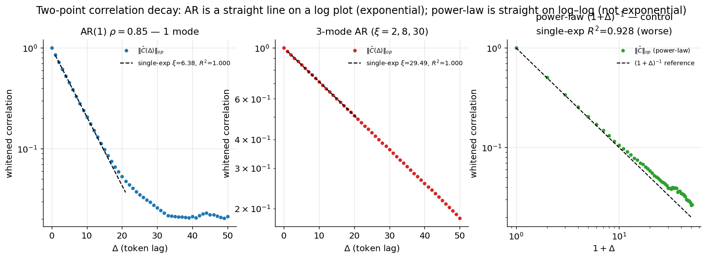
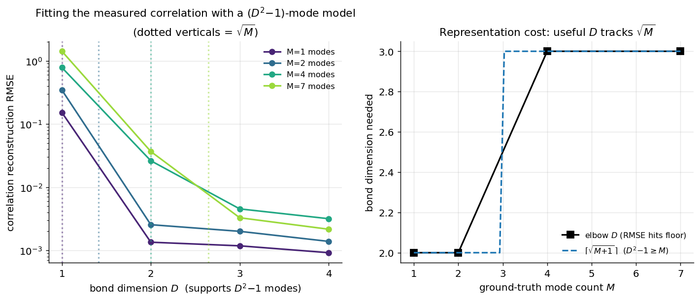
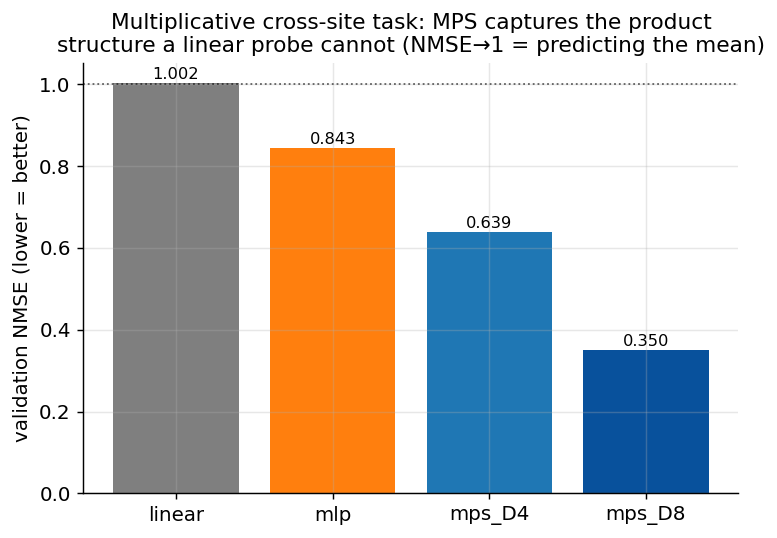

# Experiment 00 — Synthetic Validation · Summary

**TL;DR.** The pipeline is validated on processes with known answers. Correlation
diagnostics recover the true correlation length to ~3% and cleanly flag the
power-law negative control. The transfer-matrix **counting law** — a bond-$D$ MPS
represents $D^2-1$ exponential correlation modes, so capturing $M$ modes needs
$D\ge\sqrt{M+1}$ — holds exactly. The trainable MPS layer is correct and captures
multiplicative cross-site structure a linear probe cannot. Two honest caveats
(mode-counting is ill-conditioned; MPS has no edge on linear-Gaussian processes)
are documented below. **Green light to move to GPT-2.**

All 29 unit tests pass (`pytest -q`): transfer-matrix shape/spectrum, Prony
recovery, AR(1) $\xi$, power-law control, off-by-one window convention.

---

## 1. Correlation diagnostics recover ground truth

**Question.** Does the diagnostic code measure the true correlation length and tell
exponential from non-exponential decay?
**Observable.** Whitened operator-norm two-point function $\|\hat C(\Delta)\|_{op}$
vs lag $\Delta$, and a single-exponential log-linear fit.
**Prediction.** AR(1) and sum-of-AR are straight lines on a semilog plot with slope
$-1/\xi$; power-law is curved on semilog but straight on log–log.



**Result.**

| process | true $\xi$ | fitted $\xi$ (op-norm) | single-exp $R^2$ | notes |
|---|---|---|---|---|
| AR(1), $\rho=0.85$ | 6.15 | **6.38** | **1.000** | clean single exponential |
| 3-mode AR, $\xi=2,8,30$ | 30 (slowest) | **29.49** | 1.000 | op-norm tracks the dominant (slowest) mode |
| power-law $(1+\Delta)^{-1}$ | — | 6.68 (meaningless) | **0.928** | curved on semilog, straight on log–log |

**Interpretation.** The dominant correlation length is recovered to ~3%. The
power-law control is correctly distinguished: a markedly worse single-exponential
fit and a straight line on log–log axes (right panel). The noise floor (visible as
the AR(1) curve flattening past $\Delta\approx30$) biases $\xi$ upward if the fit
window extends too far — so on real data we fit over the clean small-$\Delta$ region.

---

## 2. The transfer-matrix counting law: $D\sim\sqrt{M}$

**Question.** How large a bond dimension is needed to *represent* a correlation
function with $M$ exponential modes?
**Observable.** Reconstruction RMSE when the measured (whitened-trace) correlation
of an $M$-mode process is fit with a $(D^2-1)$-mode model, vs $D$.
**Prediction (briefing §4).** A bond-$D$ MPS transfer matrix is $D^2\times D^2$; one
eigenvalue is the disconnected part, leaving $D^2-1$ connected exponential modes. So
the error should collapse to the noise floor exactly when $D^2-1\ge M$, i.e.
$D\ge\sqrt{M+1}$.



**Result.** The error elbow lands precisely at $\lceil\sqrt{M+1}\,\rceil$:

| $M$ | observed elbow $D$ | $\lceil\sqrt{M+1}\,\rceil$ |
|---|---|---|
| 1 | 2 | 2 |
| 2 | 2 | 2 |
| 4 | 3 | 3 |
| 7 | 3 | 3 |

**Interpretation.** This is a direct, quantitative confirmation of the project's
central representational claim. The refinement worth carrying forward: the precise
law is $D^2-1\ge M$ (so $D\ge\sqrt{M+1}$), which for small $M$ differs from a naive
$\sqrt{M}$ (e.g. $M=1$ still needs $D=2$, because a $D=1$ MPS has *zero* connected
modes). For larger $M$ the two coincide.

---

## 3. The MPS layer is correct — and shows where it helps

**Question.** Does the trainable MPS implementation work, and what structure does it
capture that baselines can't?
**Observable.** Validation NMSE on a target that is a *product* of per-site linear
forms, $y_c=\prod_{j=1}^{m}(a_{c,j}\cdot v_j)$ — a degree-$m$ polynomial that an MPS
(a product of input-dependent matrices) represents naturally but a linear map cannot.
**Controls.** Linear probe (B1) and an MLP (B2).



**Result.**

| model | val NMSE | params |
|---|---|---|
| linear (B1) | **1.002** (≈ chance / predict-the-mean) | 164 |
| MLP (B2) | 0.843 | 22,276 |
| **MPS, $D=4$** | 0.639 | 708 |
| **MPS, $D=8$** | **0.350** | 2,820 |

**Interpretation.** The linear probe is at chance — it structurally cannot represent
a product across sites. The MPS captures it and beats the MLP with **~8× fewer
parameters**, confirming both that the layer trains correctly and that its advantage
is genuinely the multiplicative/correlation structure, not raw capacity.

---

## 4. Honest caveats (carry into the GPT-2 work)

1. **Mode counting is ill-conditioned.** Estimating $M$ from a noisy correlation
   function is the classic ill-posed "sum-of-exponentials" problem: modes that are
   weak or close in rate are nearly collinear and get absorbed. Our Hankel-rank
   estimator robustly gives $M=1$ for AR(1), but under-counts the 3-mode process as
   $M=2$ (the fast $\xi=2$ mode is barely above the noise floor). **Implication:** on
   GPT-2, treat $M_\ell$ and $D_{\text{pred}}\sim\sqrt{M_\ell}$ as order-of-magnitude
   guidance, and lean on the *empirical $D$-sweep saturation* as the primary readout.

2. **Linear-Gaussian processes do not favour MPS.** For an AR/Gaussian process the
   optimal predictor is linear, so an MPS *readout* has no advantage there (an early
   completion experiment confirmed MPS ≈ or worse than a linear baseline on AR data —
   expected, not a bug). The interesting question is therefore genuinely empirical:
   **do GPT-2 residual trajectories carry nonlinear/multiplicative correlation
   structure that an MPS exploits?** That is exactly what Experiments 01–02 test.

---

## Reproduce
```bash
.venv/bin/python -m pytest -q
.venv/bin/python scripts/run_synthetic_validation.py   # -> figures/, results/runs/synthetic_validation/results.json
```
