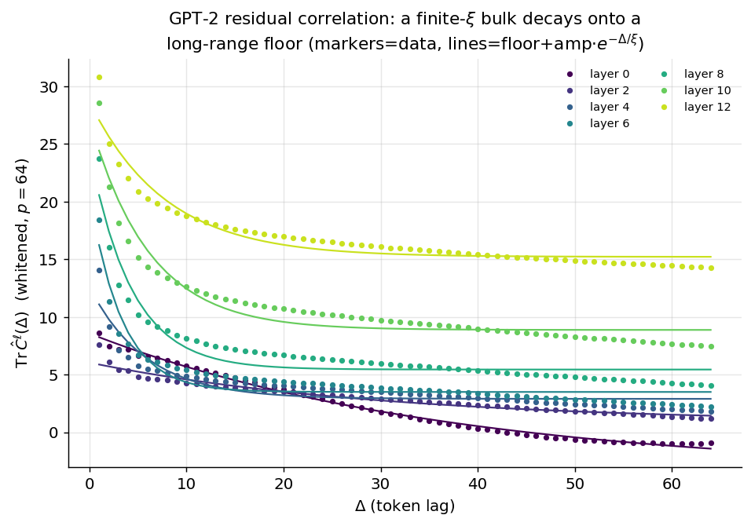
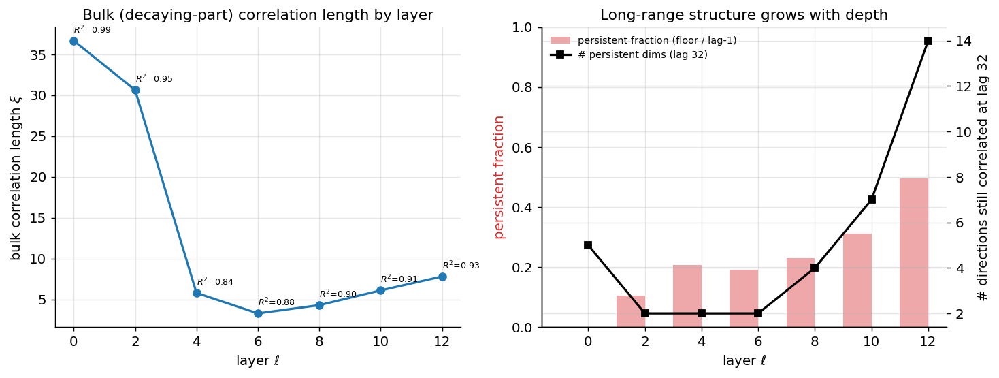
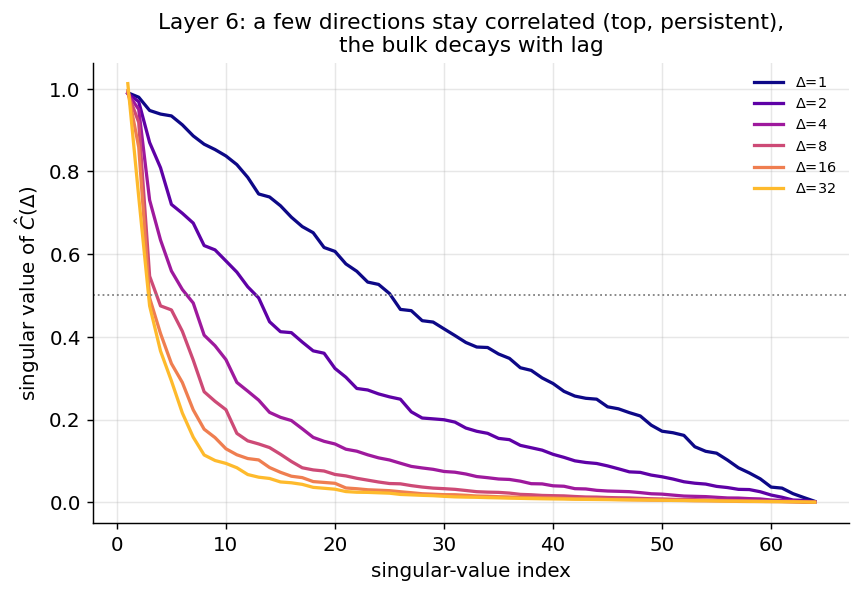

# Experiment 01 — GPT-2 Residual Correlation Diagnostics · Summary

**TL;DR.** GPT-2 residual-stream correlations along token position split into **two
parts**: a **finite-correlation-length bulk** that decays exponentially, plus a small
**long-range "persistent" subspace** that does not. The bulk correlation length is
shortest in the **middle layers** ($\xi\approx 3\text{–}4$ at layers 6–8) and the
persistent subspace **grows with depth** (from ~2 directions / 11% of the signal at
layer 2 to ~14 directions / 49% at layer 12). **This is qualified support for the MPS
hypothesis**: the bulk is exactly the finite-$\xi$, MPS-friendly structure the project
predicted, and the persistent subspace is long-range order that an MPS represents
through transfer eigenvalues near 1. **Recommended MPS targets: layers 6 and 8**
(short bulk $\xi$, small persistent subspace) — which is also where FutureLens found
future-token information concentrates.

Model GPT-2 small · WikiText-103 · ~2.0M token positions · PCA-whitened $p=64$ ·
logit-lens sanity (folded LN) = exact ($\max|\Delta\,\text{logits}|=0$).

---

## Result



The whitened trace correlation $\mathrm{Tr}\,\hat C^\ell(\Delta)$ (markers) is well
described by a **finite-$\xi$ bulk on a long-range floor**, $\text{floor}+A\,e^{-\Delta/\xi}$
(lines). Deeper layers sit higher and decay onto a higher floor.

| layer | bulk $\xi$ | fit $R^2$ | floor (trace) | persistent frac | # persistent dims (lag 32) | Hankel $M$ |
|---|---|---|---|---|---|---|
| 0 (embed)\* | 36.7 | 0.99 | −3.5\* | —\* | 5 | 3 |
| 2 | 30.6 | 0.95 | 0.8 | 0.11 | 2 | 2 |
| 4 | 5.8 | 0.84 | 2.9 | 0.21 | 2 | 2 |
| **6** | **3.3** | 0.88 | 3.5 | 0.19 | 2 | 3 |
| **8** | **4.3** | 0.90 | 5.5 | 0.23 | 4 | 3 |
| 10 | 6.1 | 0.91 | 8.9 | 0.31 | 7 | 2 |
| 12 | 7.8 | 0.93 | 15.2 | 0.49 | 14 | 2 |

\*Layer 0 is the embedding (token + positional), not a processed residual; its
`floor+exp` fit is unphysical (negative floor) — treat separately.



Two clear trends: **(left)** bulk correlation length is **U-shaped in depth**, with a
minimum at layer 6 ($\xi\approx 3.3$); **(right)** the long-range structure (persistent
fraction and number of persistent directions) **grows monotonically with depth** — by
layer 12 about half the lag-1 correlation is long-range and 14/64 whitened directions
remain correlated at a lag of 32 tokens.



Per-lag singular spectra of $\hat C(\Delta)$ make the two-part structure explicit: a
few top directions stay near 1 across lags (persistent), while the rest decay — so the
operator norm alone (which tracks only the top direction) reads as "flat / $\xi=\infty$"
and is **the wrong summary**; the trace/Frobenius reveal the decaying bulk.

---

## Interpretation

- **The bulk has finite correlation length.** Stripping the persistent subspace, the
  remaining ~50+ whitened directions decay exponentially with $\xi\sim$ a few tokens in
  the middle layers. This is precisely the regime where a low-bond-dimension MPS is the
  right model (briefing §4–5): an MPS bulk transfer spectrum with a handful of
  subleading eigenvalues can reproduce it.
- **The persistent subspace is long-range order.** A small set of directions correlated
  across all positions is the MPS *disconnected* part — represented by transfer
  eigenvalue(s) at/near $\lambda=1$. It is not a problem for an MPS per se, but it means
  the effective model is "a few near-unit modes + a finite-$\xi$ bulk", and it grows
  with depth (deep layers accumulate global/topic context that persists).
- **Middle layers are the sweet spot.** Layers 6–8 combine the shortest bulk $\xi$ with
  the smallest persistent subspace — the cleanest finite-correlation-length signal, and
  (independently) the layers FutureLens identified as carrying future-token information.
- **Decision (briefing §5.4): proceed to MPS completion on layers 6 and 8, with layer
  12 as a long-range contrast/control.** Power-law was *not* observed (the bulk is
  exponential), so the MPS inductive bias is not ruled out — the open question is
  whether that structure translates into a *predictive* advantage, which Experiment 02
  tests.

## Caveats
- **Operator norm is misleading here** (dominated by the single most-persistent
  direction); use trace/Frobenius. Fixed in the diagnostic.
- **Mode counting is ill-conditioned** (see Exp 00); the Hankel $M$ and bulk-vs-floor
  split are approximate. The bulk $\xi$ and persistent-dimension counts are robust.
- **Stationarity / position-dependent mean**: we subtract the global mean. GPT-2 has
  some position-systematic structure; a residual position-dependent mean would inflate
  apparent persistence. A per-position-centering robustness check is a worthwhile
  follow-up.
- **Single feature map.** PCA-whitened $p=64$ only; identity and learned-$\phi$ are
  follow-ups (the briefing's full $\phi$ ablation).

## Reproduce
```bash
.venv/bin/python scripts/compute_correlations.py
```
Outputs: `results/tables/correlation_fits_gpt2.csv`, `figures/`, `results/runs/gpt2_correlations/results.json`.
