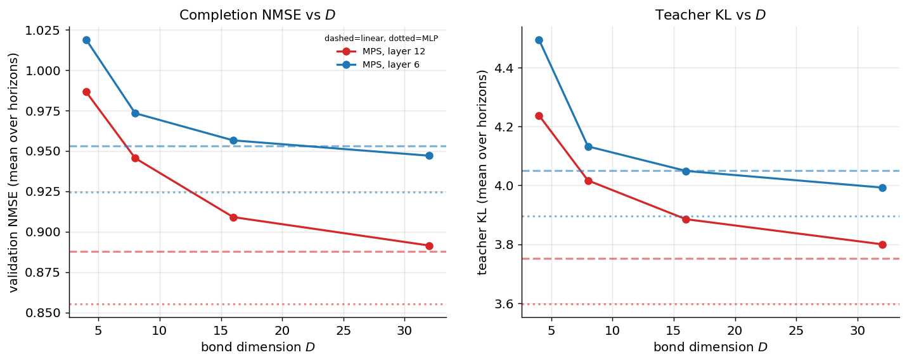
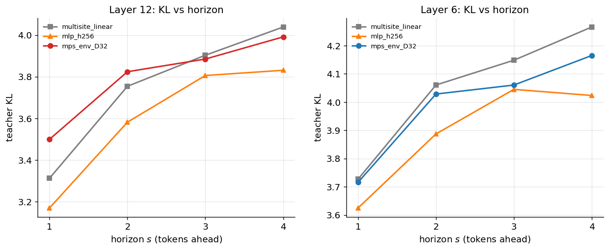

# Experiment 02 — GPT-2 Completion: Baselines vs MPS · Summary

**TL;DR (weak / honest-negative).** The MPS readout's accuracy **improves
monotonically with bond dimension $D$** — exactly as the transfer-matrix picture
predicts (more $D$ ⇒ more correlation modes ⇒ better fit). But even at $D=32$ it only
**catches up to the linear baseline and never beats the MLP**. So the
finite-correlation-length bulk found in Experiment 01 is real, yet it does **not**
translate into a predictive advantage for an MPS *readout* on this task. By the
briefing's rubric (§11) this is **weak evidence**: context and $D$ help, but the MPS's
specific multiplicative structure is not what wins here. This is consistent with both
the synthetic result (linear-Gaussian prediction doesn't favour MPS) and FutureLens
(linear future-decoding is limited; their gains came from *causal intervention*, which
a readout cannot do).

Setup: GPT-2 small · WikiText-103 · 220k windows · $m=8$, $n=4$, PCA-whitened $p=64$
source features → predict 4 future final-layer residuals · teacher-KL via folded-LN
unembed (off-by-one verified).

---

## Result



| layer | model | params | NMSE (mean) | teacher KL | top-1 @ s=1 |
|---|---|---|---|---|---|
| **6** | multi-site linear | 1.58M | 0.953 | 4.05 | 0.118 |
| 6 | **MLP (h256)** | 0.99M | **0.924** | **3.90** | **0.144** |
| 6 | MPS env $D{=}4$ | 0.06M | 1.019 | 4.50 | 0.031 |
| 6 | MPS env $D{=}32$ | 3.67M | 0.947 | 3.99 | 0.122 |
| **12** | multi-site linear | 1.58M | 0.888 | 3.75 | 0.134 |
| 12 | **MLP (h256)** | 0.99M | **0.855** | **3.60** | **0.166** |
| 12 | MPS env $D{=}4$ | 0.06M | 0.987 | 4.24 | 0.054 |
| 12 | MPS env $D{=}32$ | 3.67M | 0.891 | 3.80 | 0.117 |

- **MPS improves with $D$**: layer 6 NMSE $1.019\to0.973\to0.957\to0.947$; layer 12
  $0.987\to0.946\to0.909\to0.891$. KL falls likewise. The bond dimension *is* buying
  representational capacity, as theory says it should.
- **Asymptotes to the linear baseline, loses to the MLP.** At $D=32$ the MPS roughly
  matches multi-site-linear (and at layer 6, $s{=}1$, marginally edges it: top-1
  0.122 vs 0.118) but the MLP is clearly best at both layers and every horizon.
- **MPS is parameter-*inefficient* here**: $D{=}32$ uses 3.67M params to match a 1.58M
  linear probe; the 0.99M MLP beats both. (Contrast Exp 00, where on a genuinely
  multiplicative task the MPS was 8× *more* efficient than the MLP — so this is a
  property of the task, not the implementation.)



All probes degrade smoothly with horizon $s$ (KL rises, top-1 falls), and layer 12
(autoregressive: source = target = final layer) is uniformly more predictable than
layer 6 (cross-layer 6→12) — both as expected.

---

## Interpretation (physicist's read)

- **The $D$-scaling is the positive part.** That MPS error falls monotonically with $D$
  and saturates is the signature of a finite set of useful correlation modes — the
  bulk structure of Exp 01 is being used. This is consistent with the hypothesis at the
  *representational* level.
- **But the connected modes aren't what drives prediction.** Exp 01 showed much of the
  residual correlation is a **long-range persistent subspace** (the disconnected /
  $\lambda\approx1$ part), which a *linear* probe captures trivially. The MPS's
  advantage would have to come from the *connected* ($D^2-1$) modes; on this task they
  don't add predictive power beyond what linear + a generic nonlinearity already get.
- **A readout may be the wrong tool.** FutureLens itself found linear/readout decoding
  of future tokens saturates quickly and that the large gains required a *causal
  intervention* (learned soft prompt). An MPS *readout* inherits that ceiling. The
  fairer test of the MPS hypothesis is the **masked-MPS completion (B5)** and a
  **translation-invariant MPS whose transfer spectrum we compare to the empirical
  $\xi$** (Phase 6) — neither done here.

**Verdict: weak evidence.** The finite-$\xi$ structure exists (Exp 01) and $D$ helps
(here), but an MPS readout does not beat parameter-matched baselines. Not the strong
result, and worth reporting plainly (briefing §16).

---

## What would change the conclusion (next steps)
1. **B5 masked-MPS completion** — closer to the theory than a readout; future sites as
   learned mask vectors, bidirectional environments.
2. **Translation-invariant MPS + Phase-6 check** — extract the trained transfer
   spectrum and test whether its $\xi_\mu$ match the empirical bulk $\xi$ from Exp 01
   (the real "is it using the transfer mechanism?" test). Needs a TI model (the env
   readout here is non-TI).
3. **Project out the persistent subspace**, then re-run — isolates whether the MPS
   helps on the *connected* (finite-$\xi$) part specifically.
4. **Learned-$\phi$** (vs PCA), and **larger $n$/$m$ and a larger model** (Pythia-410M).

## Reproduce
```bash
python scripts/train_probes.py --layer 6  --device cuda:0
CUDA_VISIBLE_DEVICES=1 python scripts/train_probes.py --layer 12 --device cuda:0
python scripts/plot_probes.py
```
Outputs: `results/runs/gpt2_probes/layer_*.json`, `results/tables/probe_results_gpt2.csv`, `figures/`.
