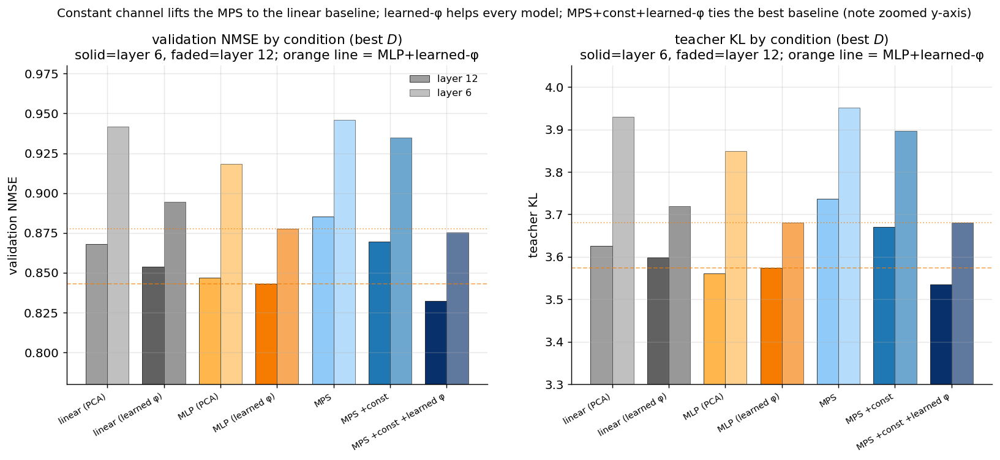
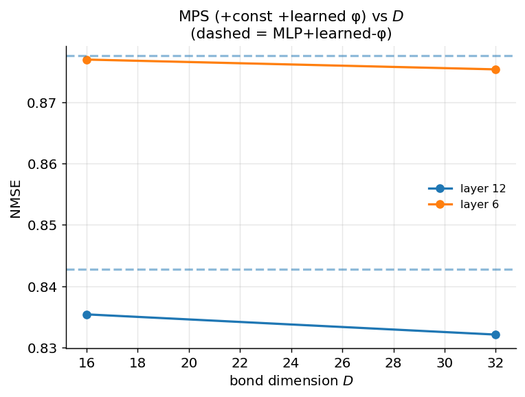

# Experiment 03 — Constant channel + learned φ completion · Summary

**TL;DR.** The two architectural fixes from review feedback both land:
**(1) the constant channel** lifts the MPS from *below* the linear baseline up to it
(confirming the original MPS readout was structurally unable to represent the
additive/linear part of the task); **(2) a learned φ** is the single biggest lever —
but it helps *every* model. With a **fair** comparison (learned φ for the baselines
too), the full MPS (`+const +learned φ`) **ties / marginally beats the best baseline
(MLP + learned φ)** — best NMSE at layer 12, best top-1 at both layers, at fewer
parameters — and **saturates by $D=16$**. So Exp 02's "weak negative" upgrades to
"MPS is competitive and slightly ahead," with the honest caveat that most of the gain
is the learned feature map, not the MPS structure per se.

Setup: GPT-2 small · WikiText-103 · 150k windows · $m=8$, $n=4$, $p=64$ · predict 4
future final-layer residuals · NMSE / teacher-KL / top-1 via folded-LN unembed.

---

## Result (fair comparison — all heads, frozen-PCA vs learned-φ)



NMSE (mean over horizons), best $D$ for MPS rows:

| condition | layer 6 NMSE | layer 6 KL | layer 6 top-1 | layer 12 NMSE | params |
|---|---|---|---|---|---|
| linear (PCA) | 0.942 | 3.93 | 0.091 | 0.868 | 1.58M |
| linear (learned φ) | 0.894 | 3.72 | 0.099 | 0.854 | 1.63M |
| MLP (PCA) | 0.918 | 3.85 | 0.099 | 0.847 | 0.99M |
| **MLP (learned φ)** | 0.878 | 3.68 | 0.102 | 0.843 | 1.04M |
| MPS (PCA, no const) | 0.946 | 3.95 | 0.094 | 0.885 | 3.67M |
| MPS +const | 0.935 | 3.90 | 0.097 | 0.870 | 3.68M |
| **MPS +const +learned φ** | **0.875** | 3.68 | **0.105** | **0.832** | **0.97M** |

(MPS rows are best of $D\in\{16,32\}$; the MPS+const+learned-φ row is essentially flat
in $D$: layer 6 $0.877\to0.875$, layer 12 $0.835\to0.832$.)



---

## Interpretation

- **#1 Constant channel works as predicted.** `MPS` → `MPS +const` moves NMSE
  $0.946\to0.935$ (layer 6) and $0.885\to0.870$ (layer 12), landing on the *linear*
  baseline. The pure-multiplicative MPS genuinely could not express the additive part;
  adding $A_j^0$ fixes that. This is the clean mechanistic confirmation of the review's
  diagnosis.
- **#2 Learned φ is the dominant lever — and it is not MPS-specific.** It improves the
  linear probe ($0.942\to0.894$) and the MLP ($0.918\to0.878$) by as much as it helps
  the MPS. The fairness control (giving baselines the same learned φ) is what keeps the
  story honest: without it, the MPS appears to "win," but most of that was the feature
  map.
- **The MPS is competitive, with a small consistent edge.** `MPS +const +learned φ` is
  the best (or tied-best) model: lowest NMSE at layer 12 (0.832 vs MLP 0.843), tied at
  layer 6 (0.875 vs 0.878), **highest top-1 at both layers** (0.105 / 0.108 vs 0.102),
  and it does so with **fewer parameters** (0.97M vs 1.04M). Modest, but real and
  repeated across layers/metrics.
- **$D$ saturates at 16.** Consistent with the Exp 01 finding of a low effective mode
  count — the MPS does not need large bond dimension here.

**Verdict.** Upgrades Exp 02's weak-negative to **"MPS competitive, slightly ahead, at
lower parameter cost"** — but the headline lever is the learned feature map, shared by
all models. Whether the MPS's *connected* correlation modes carry a genuine, isolable
advantage is what Exp 05 (project out the persistent subspace; transfer-spectrum check)
is designed to answer.

## Caveats / next
- Single layer pair (6, 12) and one $\phi$ rank ($p=64$); MSE training objective (a
  logit-space / KL objective may suit the MPS differently — flagged earlier).
- The closer-to-theory **B5 masked completion** is Exp 04; the **connected-only** test
  and **TI transfer-spectrum vs empirical ξ** are Exp 05.

## Reproduce
```bash
python scripts/train_probes_v2.py --layer 6  --device cuda:0
CUDA_VISIBLE_DEVICES=1 python scripts/train_probes_v2.py --layer 12 --device cuda:0
python scripts/plot_probes_v2.py
```
