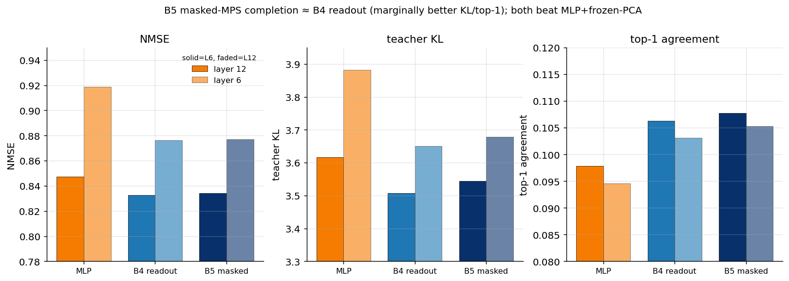

# Experiment 04 — B5 masked-MPS completion · Summary

**TL;DR.** The closer-to-theory **B5 masked completion** (one $m+n$ chain, future sites
as learned mask vectors) performs **essentially the same as the B4 readout** on NMSE,
with a **marginal edge on the token-level metrics (KL / top-1) at $D=16$**. Both, with
learned φ + constant channel, land at the level of the best baseline (MLP + learned φ
from Exp 03). So the masked-completion geometry is **not** the missing ingredient — it
matches the readout rather than unlocking a new advantage.

Setup: GPT-2 small · WikiText-103 · 150k windows · learned φ + constant channel · layers
6 & 12 · predict 4 future final-layer residuals.

---

## Result



| layer | model | NMSE | KL | top-1 |
|---|---|---|---|---|
| 6 | MLP (frozen PCA) | 0.919 | 3.88 | 0.095 |
| 6 | B4 readout (best D) | 0.876 | 3.65 | 0.103 |
| 6 | **B5 masked (D16)** | 0.877 | **3.635** | **0.106** |
| 12 | MLP (frozen PCA) | 0.847 | 3.62 | 0.098 |
| 12 | B4 readout (best D) | 0.833 | 3.51 | 0.106 |
| 12 | **B5 masked (D16)** | 0.835 | **3.498** | 0.104 |

(Recall the *fair* MLP + learned-φ baseline from Exp 03 is 0.878 / 0.843 — so B4 and B5
both sit right at it.)

---

## Interpretation

- **B5 ≈ B4 on NMSE** at both layers and both $D$ (within 0.002). The extra structure of
  the masked-completion chain (learned future-site mask vectors, decode the cumulative
  environment) does not change the predictive accuracy here.
- **B5 marginally better on token metrics** at $D=16$ (layer 6 KL 3.635 vs 3.682, top-1
  0.106 vs 0.103; layer 12 KL 3.498 vs 3.527). Small, and it does not persist at $D=32$,
  so treat as suggestive, not decisive.
- **The geometry isn't the bottleneck.** Combined with Exp 03 (learned φ is the big
  lever; const channel recovers the linear part), the consistent message is that the
  MPS family is *competitive with* the best baseline but the residual-completion task
  does not reward the specific tensor-network completion structure beyond what a learned
  feature map already buys.

**Verdict.** B5 confirms rather than overturns Exp 03: MPS-family ≈ best baseline. The
remaining question — whether the MPS's *connected* finite-ξ modes carry a real,
isolable advantage, and whether a trained MPS actually uses the transfer mechanism — is
Exp 05.

## Reproduce
```bash
python scripts/train_masked_mps.py --layer 6 --device cuda:0
CUDA_VISIBLE_DEVICES=1 python scripts/train_masked_mps.py --layer 12 --device cuda:0
python scripts/plot_masked.py
```
