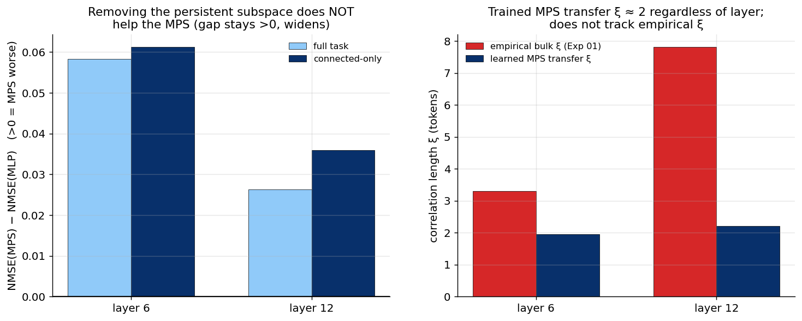

# Experiment 05 — Connected-only + TI transfer spectrum · Summary

**TL;DR (clarifying negative).** Two deep checks of whether the MPS's *specific*
mechanism is what helps — both come back negative. **(a)** Projecting out the
persistent (long-range) subspace does **not** give the MPS an edge on the remaining
finite-ξ "connected" part: the MPS stays *worse* than a matched MLP, and the gap
slightly *widens*. **(b)** A trained translation-invariant MPS learns transfer
correlation lengths **ξ≈2 at both layers**, which do **not** track the empirical bulk ξ
(3.3 at layer 6, 7.8 at layer 12) or its layer dependence. Together with Exp 03–04, the
conclusion is: the MPS family is competitive on this task because of the **learned
feature map + constant channel** (generic ingredients), **not** because its
transfer-matrix connected modes capture the residual correlation structure.

---

## (a) Connected-only test



Gap = NMSE(MPS) − NMSE(MLP), so **>0 means the MPS is worse** (autoregressive whitened
task, frozen φ for both):

| layer | full task | connected-only | persistent dims removed |
|---|---|---|---|
| 6 | +0.058 | +0.061 | 3 |
| 12 | +0.026 | +0.036 | 15 |

The MPS is worse than the MLP on the full task and **the gap does not shrink** when the
persistent subspace is removed — it grows. If the MPS's value were in the connected
finite-ξ modes, isolating them should have helped; it did not. **The connected modes are
not where an MPS advantage lives.**

## (b) TI transfer spectrum vs empirical ξ

| layer | empirical bulk ξ (Exp 01) | learned MPS transfer ξ (top modes) | TI MPS val NMSE |
|---|---|---|---|
| 6 | 3.3 | ≈ 2.0 (2.08, 1.92, 1.92, …) | 0.955 |
| 12 | 7.8 | ≈ 2.2 (2.24, 2.21, 2.21, …) | 0.918 |

The learned transfer correlation length is ≈2 **regardless of layer**, while the
empirical bulk ξ more than doubles from layer 6 to 12. The trained MPS is **not**
arranging its transfer spectrum to mirror the data's correlation structure — it settles
on a short ξ that helps the (constrained, TI) prediction loss.

---

## Interpretation

- **The MPS's competitiveness (Exp 03) is generic, not mechanistic.** It came from the
  learned φ (which helps every model) plus the constant channel (which restores the
  additive part). When we strip to the part the tensor-network is uniquely supposed to
  model — the connected finite-ξ correlations — the MPS shows no advantage, and its
  learned transfer spectrum does not reflect the measured correlations.
- **The premise survives; the mechanism does not (here).** Exp 01's finite-ξ bulk is
  real, but for *predicting future residuals* it is not the operative structure: a
  learned linear map + light nonlinearity captures the predictive signal as well as, or
  better than, the MPS's multiplicative transfer-matrix modeling.

## Caveats (important)
- **(b) is confounded by the learned φ**: the MPS sees features in a *learned* basis, so
  its transfer ξ lives in that transformed space, not the raw whitened space where
  empirical ξ was measured — the mismatch is suggestive, not airtight. A cleaner version
  fits a TI MPS with *fixed* (PCA) φ, or a TI Born-machine *generative* model of the
  sequence (no readout), whose transfer ξ is directly comparable.
- **(a)** used a frozen-φ MPS (to isolate the connected structure); a learned-φ MPS on
  connected-only features is a possible follow-up, though Exp 03 suggests the learned φ
  helps the MLP equally.
- The TI MPS is a constrained, worse-fitting model (NMSE 0.92–0.96 vs 0.875 non-TI).

## Where this leaves the project
Across Exp 01–05: **the finite-correlation-length premise is confirmed in GPT-2
residuals, but the MPS's transfer-matrix mechanism is not the thing carrying
future-token predictivity.** The most informative remaining directions are the ones that
test the *generative / representational* claim directly (a Born-machine MPS of the
residual stream, transfer ξ vs empirical with fixed φ) and scale (larger model, where
future-token structure is richer) — rather than more readout variants.

## Reproduce
```bash
python scripts/exp05_connected_transfer.py --mode connected --layer 6  --device cuda:0
python scripts/exp05_connected_transfer.py --mode connected --layer 12 --device cuda:0
python scripts/exp05_connected_transfer.py --mode transfer  --layer 6  --device cuda:0
python scripts/exp05_connected_transfer.py --mode transfer  --layer 12 --device cuda:0
python scripts/plot_exp05.py
```
