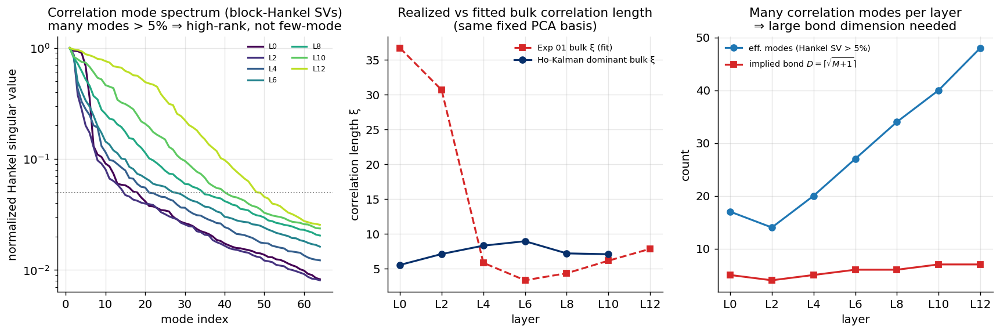

# Experiment 06 — Mechanistic realization in the fixed PCA basis · Summary

**TL;DR.** Working entirely in the fixed PCA-whitened basis (no learned-φ confound), we
realize the empirical residual correlation $C(\Delta)$ directly via Ho-Kalman/ERA. Two
findings: **(1)** the residual correlation is **high-rank — many modes, growing with
depth** (≈17 modes at layer 0 → ≈48 at layer 12 out of 64), *not* the few-mode regime
where a small-$D$ MPS is efficient; the implied bond dimension is $D\approx4$–7 and
**grows with depth**. **(2)** the *decaying* (connected) modes have correlation length
$\xi\approx5$–9 tokens, confirming a genuine finite-range bulk (consistent in order with
Exp 01), but spread over many modes. This is the clean mechanistic explanation for why
a small-$D$ MPS has no edge: the structure it would need to capture is many-moded, so
the transfer-matrix efficiency argument (great for *few* modes) is diluted.

Method validated first: Ho-Kalman on *measured noisy* synthetic correlations recovers
planted ξ (multi-mode → {29.9, 7.9, 2.0} ≈ {30, 8, 2}; AR(1) → 6.2 ≈ 6.15).

---

## Result



| layer | eff. modes (Hankel SV>5%) | implied $D=\lceil\sqrt{M{+}1}\rceil$ | realized bulk ξ (decaying modes) | Exp 01 bulk ξ |
|---|---|---|---|---|
| 0 (embed) | 17 | 5 | 5.5, 2.3, 1.0 | 36.7\* |
| 2 | 14 | 4 | 7.1, 7.1, 2.7 | 30.6\* |
| 4 | 20 | 5 | 8.3, 7.2, 5.0 | 5.8 |
| 6 | 27 | 6 | 8.9, 8.5, 7.3 | 3.3 |
| 8 | 34 | 6 | 7.2, 7.0, 7.0 | 4.3 |
| 10 | 40 | 7 | 7.0, 7.0, 7.0 | 6.1 |
| 12 | 48 | 7 | — (all modes \|λ\|>0.9) | 7.8 |

\*Early-layer Exp-01 single-exp-on-trace fit absorbs a slow/near-persistent component
into a large ξ; the realization instead splits that into persistent modes ($|\lambda|>0.9$)
plus a faster decaying bulk (ξ≈5–7). Both descriptions are consistent.

---

## Interpretation

- **High-rank, not few-mode.** The left panel shows the block-Hankel singular spectrum
  decays slowly — tens of modes sit above 5% of the leading one, and the count *grows
  with depth* (right panel). The residual correlation in the 64-dim PCA feature space is
  therefore a genuinely many-body, many-mode object, not a 1–3 mode chain.
- **Implied bond dimension is moderate and grows.** $D\sim\sqrt{M{+}1}\approx4$–7,
  increasing with layer. An MPS *can* represent this, but only at non-trivial $D$, and
  with no parsimony advantage over dense models — matching Exp 02–05, where the MPS
  needed $D\gtrsim16$ just to be competitive.
- **The bulk is finite-range.** The decaying modes have $\xi\approx5$–9 tokens across
  layers — a real, finite correlation length (the physics premise holds) — but it is
  carried by many directions, and deep layers additionally accumulate a large persistent
  ($|\lambda|\approx1$) subspace (all 48 modes persistent at layer 12).
- **This is the mechanistic resolution of Exp 05.** Exp 05 found the trained MPS didn't
  match empirical ξ; here, in the clean basis, we see *why a small-D MPS shouldn't*: the
  correlation is high-rank. The MPS transfer-matrix advantage is real only when a *few*
  modes dominate, which is not the GPT-2 residual regime.

## Updated physics picture
$$V_i \approx \underbrace{G_i}_{\text{persistent / global, grows with depth}} + \underbrace{B_i}_{\text{finite-}\xi\text{ bulk, } \xi\sim5\text{–}9,\ \text{but many modes}}$$
The bulk is finite-range (premise ✓) but **many-moded** (so no small-$D$ MPS parsimony),
and the persistent subspace grows with depth (the long-range-order component).

## Caveats
- Ho-Kalman rank/eigenvalues on noisy data are sensitive (rank capped at 30 for the
  eigenvalue realization; the SV-based mode count is the robust readout). Exact mode
  counts are approximate; the *trend* (high-rank, growing with depth) is robust.
- Linear-Gaussian realization assumes the correlation structure is second-order; genuine
  higher-order (non-Gaussian) structure in GPT-2 residuals is not captured here (and is
  where a nonlinear MPS could in principle still help — see Exp 07/10).

## Reproduce
```bash
python scripts/exp06_mechanistic.py --mode both --device cuda:0
```
