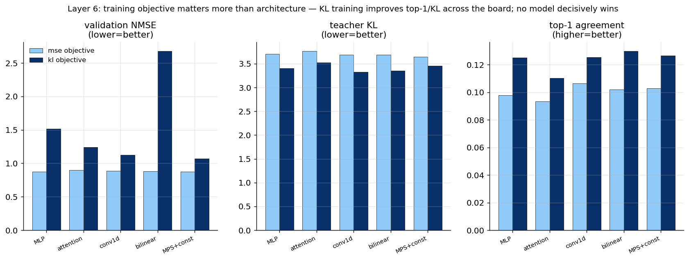

# Experiment 07 — Strong baselines + KL/logit objective · Summary

**TL;DR.** Against baselines that are genuinely good at sequence structure (attention,
1D-conv, low-rank bilinear) and under the *correct* training objective (teacher KL
through the frozen unembed), **the MPS has no edge**. The decisive lever is the
**objective, not the architecture**: switching from residual MSE to KL training lifts
top-1 agreement from ~0.10 to ~0.13 (≈30% relative) across all models, and the best
token-level models under KL are **conv1d and bilinear**, not the MPS. (Bilinear — a
fixed low-rank *multiplicative* form — is best on top-1, so multiplicative structure
helps, but you don't need a full MPS to get it.)

Layer 6 · $m=8$, $n=4$, $p=64$ · 150k windows · all probes learned-φ (+const for MPS).

---

## Result



| model | MSE: NMSE / KL / top-1 | KL: NMSE / KL / top-1 |
|---|---|---|
| MLP | 0.877 / 3.70 / 0.098 | 1.51 / 3.40 / 0.125 |
| attention | 0.897 / 3.77 / 0.093 | 1.24 / 3.52 / 0.110 |
| conv1d | 0.886 / 3.69 / **0.107** | 1.13 / **3.33** / 0.125 |
| bilinear | 0.879 / 3.68 / 0.102 | 2.68 / 3.35 / **0.130** |
| MPS +const | **0.877 / 3.65** / 0.103 | 1.07 / 3.45 / 0.126 |

(KL-trained models have high residual NMSE by construction — they optimise token KL,
not residual reconstruction.)

---

## Interpretation

- **Objective ≫ architecture for token prediction.** Every model's top-1 rises ~0.10→
  0.13 and KL falls ~3.7→3.3–3.4 when trained on KL instead of MSE. The Exp 02–05
  story ("MPS ties baselines") was partly an artifact of optimising residual MSE, which
  reconstructs unembedding-irrelevant directions. This validates the review's concern.
- **The MPS is competitive but never best.** Under MSE it has the best NMSE/KL by a hair;
  under KL it is mid-pack (conv1d best KL, bilinear best top-1). No objective makes the
  MPS the winner.
- **Multiplicative structure helps a little — generically.** Bilinear (a fixed
  second-order form) gets the best top-1 under KL, echoing Exp 00 (MPS shines on
  multiplicative tasks). But the cheap bilinear captures it; the MPS's full
  transfer-matrix machinery adds nothing on top.

**Verdict.** With strong baselines and the right objective, there is no MPS-specific
predictive advantage. The most actionable finding is methodological: **train on KL/logit
loss, not residual MSE** — it helps every probe substantially.

## Reproduce
```bash
python scripts/exp07_strong_baselines.py --objective mse --layer 6 --device cuda:0
python scripts/exp07_strong_baselines.py --objective kl  --layer 6 --device cuda:0
python scripts/plot_exp07.py
```
