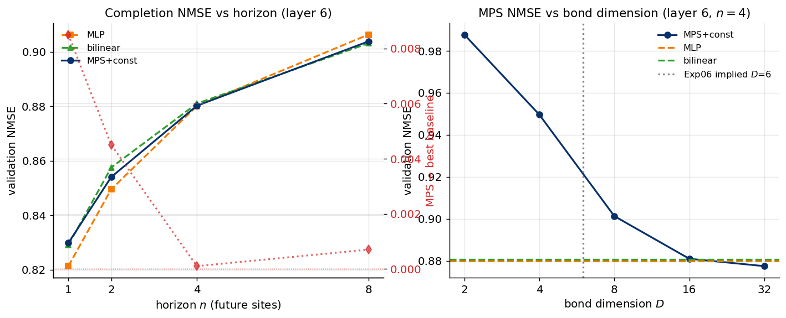

# Experiment 08 — Horizon (n) and bond (D) sweeps · Summary

**TL;DR.** Two sweeps at layer 6. **(Horizon)** the MPS goes from slightly *worse* than
the best baseline at the shortest horizon to *tied* at longer horizons — the gap shrinks
from +0.009 (n=1) to ≈0 (n=4, n=8), mildly consistent with "tensor structure matters
more when correlations propagate over more sites", but it only ever reaches a tie.
**(Bond)** MPS NMSE falls monotonically with $D$ and saturates at the baseline level by
$D\approx16$–32 — the useful $D$ is moderate, in line with the high-rank (≈27 modes,
implied $D\approx6$) structure measured in Exp 06.

Layer 6 · learned-φ + const · 150k windows.

---

## Result



**Horizon** (NMSE; gap = MPS − best baseline):

| n | MLP | bilinear | MPS | MPS − best |
|---|---|---|---|---|
| 1 | 0.821 | 0.829 | 0.830 | +0.009 |
| 2 | 0.850 | 0.858 | 0.854 | +0.004 |
| 4 | 0.880 | 0.881 | 0.880 | +0.000 |
| 8 | 0.906 | 0.903 | 0.904 | +0.001 |

**Bond** (NMSE, n=4): D=2 → 0.988, D=4 → 0.950, D=8 → 0.901, D=16 → 0.881, D=32 → 0.878.
References: MLP 0.880, bilinear 0.881. Exp-06 implied $D\approx6$ for this layer.

---

## Interpretation

- **Horizon:** the single-site prediction (n=1) is where the MPS is *worst* (no chain
  to exploit — a dense map wins); as the horizon grows the MPS catches up to a tie. So
  the tensor structure becomes *relatively* more useful with horizon, but does not
  cross into an advantage within $n\le8$. A longer-horizon regime ($n\gg8$) is the place
  to look if any MPS edge exists — flagged for follow-up.
- **Bond:** the smooth saturation by $D\approx16$ matches the moderate effective mode
  count from Exp 06 ($\approx$27 modes → $D\sim6$ to start helping, saturating by ~16
  once noise modes are included). The MPS reaches but does not exceed the strong
  baselines.

**Verdict.** Consistent with Exp 03–07: MPS competitive, never decisively ahead; its
relative standing improves with horizon and saturates in $D$ at the baseline level.

## Reproduce
```bash
python scripts/exp08_sweep.py --part horizon --device cuda:0
python scripts/exp08_sweep.py --part bond    --device cuda:0
python scripts/plot_exp08.py
```
