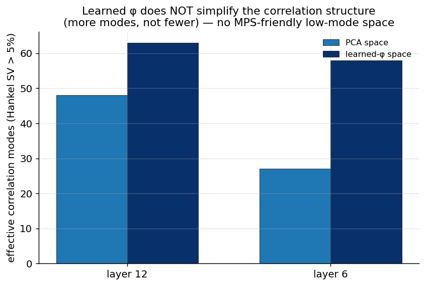

# Experiment 09 — Bridge: correlations in the learned-φ space · Summary

**TL;DR.** The "most interesting follow-up": does the *learned* φ (the thing that drove
the predictive wins) create a correlation structure that is MPS-friendly — i.e.
lower-rank / fewer modes than the fixed PCA basis? **No — the opposite.** In the
learned-φ space the residual correlation has *more* effective modes than in PCA space
(layer 6: 27 → 58; layer 12: 48 → 63), and at least as large a persistent subspace. So
the learned φ is not selecting a few-mode, finite-ξ-friendly subspace; it is extracting
good predictive features that, if anything, have *richer* correlation structure.

---

## Result



| layer | effective modes (PCA space) | effective modes (learned-φ space) | persistent (PCA → φ) |
|---|---|---|---|
| 6 | 27 | 58 | 15 → 30 |
| 12 | 48 | 63 | 30 → 30 |

(Ho-Kalman / block-Hankel-SV mode count, whitened, same pipeline as Exp 06.)

---

## Interpretation

- **The learned φ does not simplify the correlation structure.** If the MPS were
  winning because φ rotated the residuals into a low-mode, finite-ξ space where the
  transfer-matrix mechanism applies, the learned-φ space would show *fewer* modes than
  PCA. It shows more. So the learned φ's value (Exp 03/07) is generic feature selection,
  not the creation of an MPS-mechanistic regime.
- **Closes the Exp 05 confound from the other side.** Exp 05 noted the learned-φ
  transfer-spectrum comparison was confounded because the MPS lives in a learned basis.
  Here we measure correlations directly in that learned basis and find it is *more*
  many-moded — so there is no hidden basis in which the MPS's few-mode advantage is
  realised.

**Verdict.** Together with Exp 05/06, this rules out the remaining "maybe the learned φ
makes the transfer story true" escape hatch: it does not. The MPS's competitiveness is
feature-extraction + capacity, not transfer-matrix physics.

## Caveats
- Effective-mode counts near $p=64$ (learned-φ at L12 → 63) are close to the feature-dim
  ceiling; the qualitative result (φ does not reduce the count) is robust, exact counts
  are approximate.

## Reproduce
```bash
python scripts/exp09_bridge.py --layer 6  --device cuda:0
python scripts/exp09_bridge.py --layer 12 --device cuda:0
python scripts/plot_exp09.py
```
