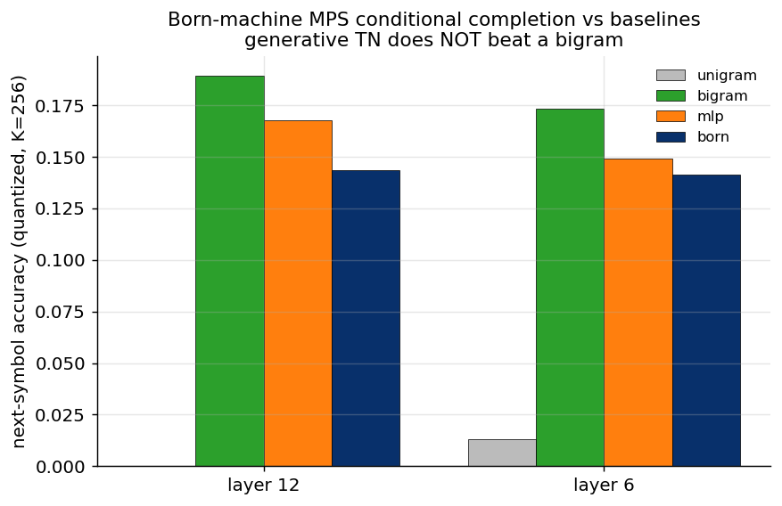

# Experiment 10 — Born-machine MPS: discrete conditional completion · Summary

**TL;DR.** The most theory-faithful test — a genuine *generative* Born MPS
($P(z)=|\Psi(z)|^2/Z$) over quantized residual symbols, conditioned to complete the
future — confirms the rest of the program. The Born MPS **does learn the chain
distribution** (test NLL ≈51 vs 66.5 for uniform), but at conditional next-symbol
prediction it is **beaten by a simple bigram** (layer 6: Born 0.141 vs bigram 0.173;
layer 12: 0.143 vs 0.189) and by a discriminative MLP. The quantized residual sequence
is dominated by 1-step structure, and the full tensor-network completion adds nothing
beyond the immediately preceding symbol. Validated first on a sticky Markov chain, where
the Born MPS recovers the *optimal* conditional predictor.

---

## Result



| layer | Born test NLL (uniform 66.5) | next-symbol acc: Born / MLP / bigram / unigram |
|---|---|---|
| 6 | 51.0 | 0.141 / 0.149 / **0.173** / 0.013 |
| 12 | 52.3 | 0.143 / 0.168 / **0.189** / 0.000 |

Sanity (sticky-Markov, K=4): Born conditional acc 0.837 = optimal predictor 0.839 — the
machinery is correct.

---

## Interpretation

- **The generative TN learns the distribution but doesn't condition better than a
  bigram.** The Born MPS's NLL is far below uniform, so it captures real structure; yet
  its conditional next-symbol prediction trails the bigram, which uses only the previous
  symbol. So whatever longer-range structure the Born MPS encodes does not translate into
  conditional predictive value over the 1-step baseline — the same message as Exp 02–09
  in the *generative* setting.
- **Consistent with the high-rank, short-range picture.** Exp 06 found finite-ξ bulk
  (~a few tokens) over many modes; here the bigram (1-step) captures most of the
  predictable symbolic structure, and the persistent clustering makes "predict the
  previous symbol" strong.
- **Caveat — quantization is lossy.** Mapping a 768-dim residual to one of K=256 symbols
  discards most of the signal (all next-symbol accuracies are low, ~0.14–0.19); this is a
  coarse symbolic abstraction. The Born MPS is the faithful *mechanism* test, not a
  high-fidelity predictor. A continuous/Gaussian-emission Born MPS would avoid the
  quantization loss but reduces (for Gaussian data) to the linear realization already
  done in Exp 06.

**Verdict.** Completes the picture: a true conditional tensor-network completion does not
beat simple baselines either. Across the readout (B4), masked-completion (B5), and now
generative Born (B6) forms, **no tensor-network variant shows a mechanism-driven
advantage** on GPT-2 residual completion.

## Reproduce
```bash
python scripts/exp10_born.py --layer 6  --device cuda:0
python scripts/exp10_born.py --layer 12 --device cuda:0
python scripts/plot_exp10.py
```
