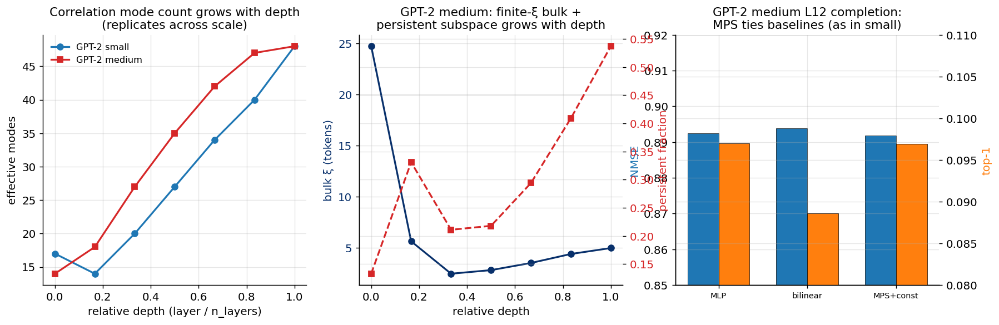

# Experiment 11 — Scale up to GPT-2 medium · Summary

**TL;DR.** GPT-2 medium (2× depth/width of small) **replicates the entire picture**:
a finite-ξ correlation bulk (ξ a few tokens, minimum mid-network), a persistent
long-range subspace whose fraction grows with depth (0.13 → 0.54), a high and
depth-growing correlation-mode count (14 → 48), and — at layer 12 — an MPS that **ties**
the MLP and bilinear baselines (NMSE 0.892 vs 0.893; top-1 0.097). Scale does not rescue
or refute the conclusions: the premise holds and the MPS has no edge, at both scales.

GPT-2 medium · WikiText-103 · ~1.5M positions · PCA-whitened $p=64$ · logit-lens exact.

---

## Result

**Correlation structure (per layer):**

| layer (of 24) | bulk ξ | persistent frac | eff. modes |
|---|---|---|---|
| 0 (embed) | 24.7 | 0.13 | 14 |
| 4 | 5.6 | 0.33 | 18 |
| 8 | 2.5 | 0.21 | 27 |
| 12 | 2.8 | 0.22 | 35 |
| 16 | 3.5 | 0.29 | 42 |
| 20 | 4.4 | 0.41 | 47 |
| 24 | 5.0 | 0.54 | 48 |

**Predictive completion (layer 12, learned φ, MSE):**

| model | NMSE | KL | top-1 |
|---|---|---|---|
| MLP | 0.893 | 4.11 | 0.097 |
| bilinear | 0.894 | 4.08 | 0.089 |
| MPS +const (D16) | 0.892 | 4.09 | 0.097 |

---

## Interpretation

- **Structure replicates across scale.** The effective mode count grows with relative
  depth on the same curve for small and medium (left panel); the bulk ξ is U-shaped
  (shortest in the early-middle, ~2.5 tokens) and the persistent fraction climbs toward
  ~0.5 by the last layer — exactly the GPT-2-small pattern. The "finite-ξ bulk + growing
  global subspace" model is a robust, scale-invariant description of GPT-2 residuals.
- **No MPS edge at larger scale.** At layer 12 the three models are within 0.002 NMSE
  and identical top-1 — the same tie seen on GPT-2 small. Scaling 124M → 345M does not
  open up an MPS advantage on completion.

**Verdict.** The conclusions are scale-robust. This argues that the absence of an MPS
mechanism advantage is not a small-model artifact, and that the natural next scale
(GPT-J-6B, FutureLens's model) is unlikely to change the *mechanistic* story — though it
would be the right venue to test the *predictive* ceiling with the causal-intervention
variant (a different probe class).

## Reproduce
See `plan.md`.
