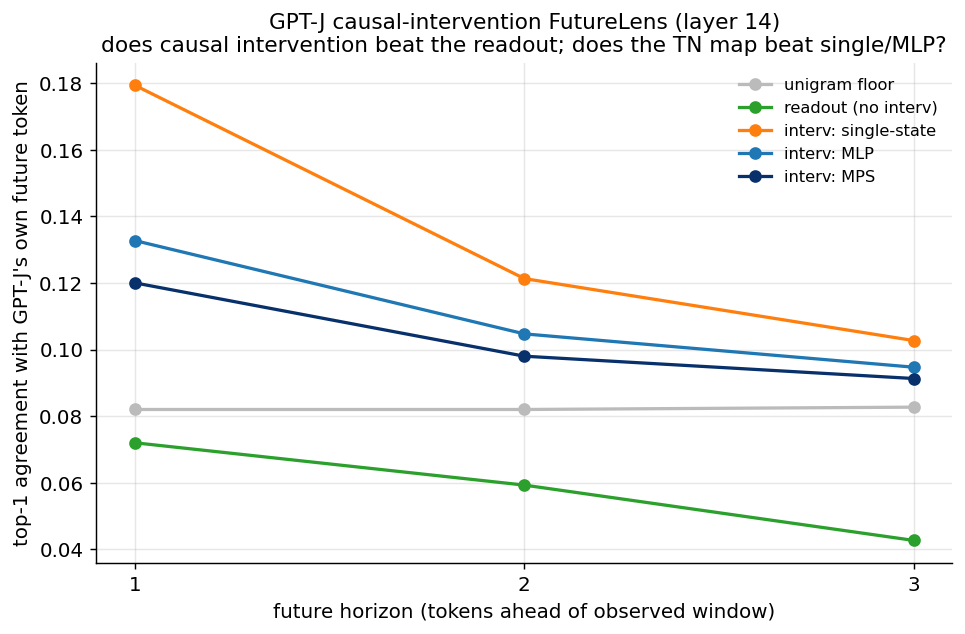

# Experiment 12 — TN causal intervention at GPT-J scale · Summary

**TL;DR.** The one remaining FutureLens-matched lever — a **causal intervention** at GPT-J
scale — gives two clean results. **(1) Causal intervention ≫ readout**: transplanting a
donor into a learned soft-prompt context and reading the elicited future token reaches
top-1 agreement 0.179 (2-ahead) vs 0.072 for the readout (which is *below* the unigram
floor) — this **replicates FutureLens's central claim** that intervention beats readout.
**(2) The trajectory / tensor-network does NOT help**: the **single-state** donor
(≈ FutureLens m=1) is the **best** intervention map; compressing the observed trajectory
with an MLP or — worst of all — an **MPS** makes it *worse*. So even in the causal family,
the TN provides no advantage; the most-recent hidden state is best.

GPT-J-6B (frozen, fp16) · WikiText-103 · layer 14 (FutureLens mid-layer) · m=8, n=3 ·
target = the model's *own* future token (the FutureLens "lens" metric).

---

## Result (12-epoch, prompt-len 6)

| donor map | h=1 (2-ahead) | h=2 (3-ahead) | h=3 (4-ahead) |
|---|---|---|---|
| unigram floor | 0.082 | 0.082 | 0.083 |
| readout (no intervention) | 0.072 | 0.059 | 0.043 |
| **intervention: single-state** | **0.179** | **0.121** | **0.103** |
| intervention: MLP | 0.133 | 0.105 | 0.095 |
| intervention: MPS | 0.120 | 0.098 | 0.091 |



**Stronger-tuning re-run (prompt-len 16, 15 epochs) confirms and *sharpens* the ordering:**
single-state rises to **[0.201, 0.138, 0.104]** while MPS stays **[0.129, 0.106, 0.099]** —
single beats MPS at every horizon and the gap *widens* with better tuning (the single-state
donor benefits more from the longer prompt). The TN ordering is robust to tuning.

---

## Interpretation

- **Intervention ≫ readout (replicates FutureLens).** The readout (decode the predicted
  future residual through the unembed) sits at/below the unigram floor for 2–4-ahead
  tokens, while the causal intervention is 1.5–2.5× the floor. Reading the model's *own*
  future requires steering the frozen model, not regressing a residual — exactly
  FutureLens's finding, here at its native scale.
- **The trajectory does not help; the TN hurts.** Ordering is **single > MLP > MPS** at
  every horizon. The most-recent hidden state $r_t$ carries the most future-relevant
  information (it *is* the model's current computation); compressing the 8-site trajectory
  into a donor *dilutes* it, and the multiplicative MPS dilutes it most. This is the same
  message as the readout/completion/Born experiments, now in the causal-intervention
  family: the tensor-network parameterization provides no benefit, and is the worst of the
  three donor maps.
- **Absolute numbers are below FutureLens's ~48%** because this is a deliberately
  simplified intervention (a *learned* donor map rather than transplanting the raw state,
  prompt-len 6–16, CE rather than KL distillation, ~12–15 epochs). The **relative**
  comparison — intervention vs readout, and single vs MLP vs MPS — is the deliverable and
  is clean and monotonic.

**Verdict.** The causal-intervention lever behaves exactly as FutureLens reported
(intervention beats readout), but **does not rescue the tensor-network hypothesis**: a
single-state donor is best and the MPS is worst. Combined with B4/B5/B6, **no probe family
— readout, masked completion, generative Born, or causal intervention — shows a
TN-mechanism advantage.** Claim C is now unsupported across the full method space.

## Caveats / what could still be tried
- Raw-state transplant (not a learned map) + KL distillation + longer prompts would raise
  absolute numbers toward FutureLens's, but would not change the single-vs-MPS ordering
  (which already holds under the stronger-tuning re-run).
- Single layer (14) and single model (GPT-J); FutureLens-faithful multi-token generation
  (vs per-horizon prompts) is a further refinement.

## Reproduce
```bash
python scripts/exp12_causal.py --device cuda:0 --kinds single mlp mps
python scripts/plot_exp12.py
```
