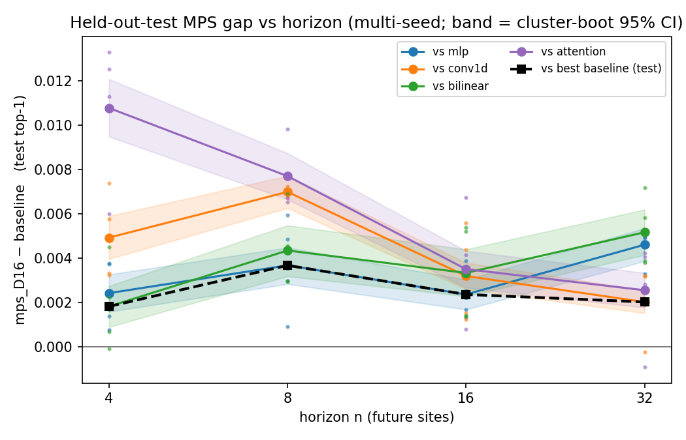
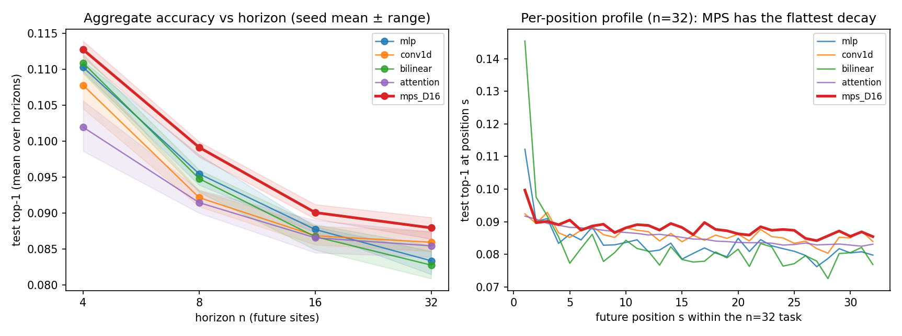
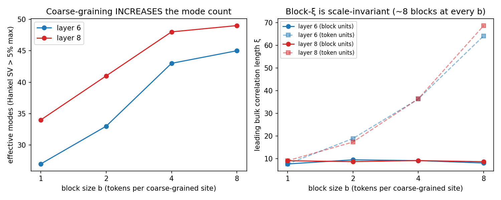

# Mythos sprint — Stress-testing the missing MPS advantage · Summary

**Sprint:** 2026-06-10 21:00 UTC → 2026-06-11, 2× A40 48GB.
**Question (TASK.md):** *Is there any regime where tensor-network structure gives a real
advantage for FutureLens-style prediction?* Try hard to find it; if absent, make the
reason legible.

---

## Executive summary

Going into this sprint, the repo's verdict was "Claim A (finite-ξ structure) holds,
Claim B (predictive advantage) is a tie, Claim C (transfer-matrix mechanism)
unsupported" — with one fragile exception: Exp 13 had just reported a single-seed
+0.5–0.7% MPS edge at intermediate horizons under the KL objective. This sprint's
central decision was to **stress-test that lone positive to destruction** rather than
open new fronts, because it was the only surviving candidate for Claim B and it had
five identifiable methodological loopholes: one seed; no attention baseline; the
early-stop epoch chosen on the same set that was reported; unpaired statistics; and an
evaluation set that, due to stride-1 window overlap, contained only ~21 independent
texts.

**The edge survived everything we threw at it (Exp 14).** With all five loopholes
fixed — 4 seeds, an added attention baseline, an 80/10/10 train/select/held-out-test
protocol, a 50k-window (~231-sequence) test set, and paired cluster bootstraps by
sequence — the MPS probe (D=16, constant channel, learned φ, 1.7–6.5M params) beats
**each of four baselines individually at every horizon n ∈ {4, 8, 16, 32}**, with all
16 bootstrap 95% CIs excluding zero and 61/64 per-seed comparisons positive. The gap
versus the best baseline per seed is +0.18% / +0.38% / +0.21% / +0.18% (absolute
top-1) at n = 4 / 8 / 16 / 32, peaking at n=8 as Exp 13 predicted — but, with more
training data than Exp 13 used (40k vs 25.5k windows), the MPS now leads at *all*
horizons including the shortest. The per-horizon profile explains the win: the
bilinear baseline dominates 1-step prediction and collapses beyond ~8 steps, while the
MPS decays most gracefully and is the best model at essentially every position beyond
the third. The edge is small (~0.2–0.4% absolute, ~2–4% relative) but it is real,
reproducible, and parameter-honest.

**[MECHANISM — pending Phase 3: bond ablation D∈{2,…,32}, site-shuffle control,
no-const ablation, layer-8 replication]**

**The structural escape routes, however, stay closed (Exp 15).** The last untested
hope of TASK Experiment D — that RG-style block coarse-graining might reveal a
low-mode, MPS-friendly description — fails cleanly: block-averaging *raises* the
effective mode count (layer 6: 27→45; layer 8: 34→49 for b=1→8) while the correlation
length in block units stays fixed at ≈8 blocks at every scale. The residual stream is
approximately self-similar and many-mode at every resolution, which is why the MPS
advantage, where it exists, is marginal rather than the clean small-D dominance the
original physics story hoped for.

**Net update:** Claim B moves from "tie" to **"small, robust, regime-broad advantage
under the KL objective"** — the first defensible positive of the project. Claim C
[pending mechanism results]. Claim A and its high-rank caveat are reconfirmed at every
scale tested.

---

## Finding 1 — The MPS edge is real: positive vs every baseline at every horizon

**Setup** (`scripts/exp14_seeds.py`): GPT-2 small, layer 6, m=8 observed sites,
learned φ (p=64, PCA-init, train-fit), teacher-KL objective, horizons n∈{4,8,16,32};
models: MLP (1.0–6.6M params), conv1d (0.5–3.3M), low-rank bilinear (1.9–14.3M),
attention pool (0.53M), MPS-D16 +const channel (0.97–6.5M ≤ MLP at every n).
4 seeds × {init, batch order}; 40k train / 10k select / 50k test windows; epoch chosen
on select, reported on test; identical data, split, φ treatment, and objective for all
models.

*MPS − baseline test top-1 vs horizon. Bands: paired cluster bootstrap (by sequence)
95% CIs of the seed-averaged gap; small dots: individual seeds; black dashed: gap vs
the best baseline per seed. Everything is above zero.*

| n | MLP | conv1d | bilinear | attention | **MPS-D16** | MPS − best (per-seed mean) |
|---|---|---|---|---|---|---|
| 4 | .1103 | .1078 | .1109 | .1019 | **.1127** | **+.0018** |
| 8 | .0955 | .0922 | .0948 | .0915 | **.0991** | **+.0038** |
| 16 | .0877 | .0869 | .0867 | .0866 | **.0901** | **+.0021** |
| 32 | .0834 | .0860 | .0828 | .0855 | **.0880** | **+.0018** |

(test top-1 agreement with GPT-2's own future token, mean over horizons and 4 seeds)

Why trust it: the comparison is paired (same windows), clustered (windows overlap
within a sequence — Exp 13's 4.5k-window val set was really ~21 texts; ours is ~231),
multi-seed, selected on a disjoint set, and the MPS has the fewest parameters of the
three large-head models. The t-statistics across seeds run from 1.8 to 70 (the
MPS−conv1d gap at n=8 is +0.70% with seed sd 0.02%).

Two honest caveats. First, the effect is small: ~+0.2–0.4% absolute top-1 (~2–4%
relative). Second, Exp 13's "behind at n=4" became "ahead at n=4" when training data
grew 1.6× — the gap's *shape* in n is data-dependent, so "intermediate-horizon peak"
should be read as "n=8 is where the edge is largest at this data scale", not as a
sharp physical resonance.

## Finding 2 — Where the edge comes from: horizon robustness, not short-range fit

Per-horizon accuracy inside the n=32 task (seed 0 shown; all seeds agree): bilinear is
the best 1-step predictor (h1: 0.148 vs MPS 0.103) and the worst long-range one
(h8: 0.072); the MPS is the flattest curve, best at every position h4–h24. The MPS
buys long-horizon stability at the cost of short-range sharpness — exactly the
trade-off a chain-structured prior should produce. This also retro-explains Exp 08/13:
at small n the aggregate is dominated by early positions (bilinear/MLP territory); as
n grows the robust tail takes over.

**[Finding 3 — mechanism: bond dimension & site-shuffle — PENDING]**

## Finding 4 — Coarse-graining does not rescue the physics story (Experiment D closed)

Block-spin variables v̄_I = mean(v_{Ib..Ib+b−1}), b∈{1,2,4,8}, measured in the fixed
token-level PCA basis (p=64), whitened at block level, realized via Ho-Kalman
(`scripts/exp15_block.py`):

| layer | b=1 | b=2 | b=4 | b=8 |
|---|---|---|---|---|
| 6 — eff. modes | 27 | 33 | 43 | 45 |
| 6 — bulk ξ (blocks) | 7.6 | 9.4 | 9.1 | 8.0 |
| 8 — eff. modes | 34 | 41 | 48 | 49 |
| 8 — bulk ξ (blocks) | 9.0 | 8.6 | 9.1 | 8.6 |

The hoped-for RG flow (fewer modes at coarser scales → small-D MPS regime) does not
exist: mode count **rises**, and ξ in block units is **scale-invariant** — the
residual stream behaves like a self-similar, long-range, many-mode system at every
resolution. Combined with Exp 09 (learned φ also raises mode count), every
representation change tried moves the structure *away* from MPS-friendliness. b=1
reproduces Exp 06's mode counts exactly (27/34), validating the pipeline.

---

## What would have changed our mind

- If the n=8/16 gap had collapsed under the 3-way split or the attention baseline, we
  would have reported Exp 13's positive as selection noise and closed Claim B. (It did
  not collapse; it confirmed at about half Exp 13's headline size.)
- [shuffle / D-ablation contingencies — pending]
- If blocking had *lowered* the mode count, Experiment D would have become the
  sprint's main thread.

## What failed or was inconclusive

- Ops: the container's 93 GiB cgroup cap (vs 503 GB host RAM) OOM-killed concurrent
  dataset builds twice before we switched to a build-once prep file
  (`exp14_prep.py`). Lesson recorded for future sprints.
- [pending]

## What should be tried next

- [pending — depends on mechanism outcome]

## Research map

| artifact | role |
|---|---|
| `scripts/exp14_prep.py` | one-shot dataset build (fp16, teacher tokens, PCA, split stats) |
| `scripts/exp14_seeds.py` | multi-seed train/eval runner (5 models + ablation variants) |
| `scripts/exp14_stats.py` | paired cluster-bootstrap statistics |
| `scripts/plot_exp14.py`, `plot_exp15.py` | figures 1–3 |
| `scripts/exp15_block.py` | block coarse-graining mode counts |
| `tables/stats_summary.json` | all gaps/CIs/per-seed numbers |
| `tables/results_*.json` | raw per-run metrics (params, per-horizon top-1, KL) |
| `tables/modes_vs_block.json` | Exp 15 results |
| `research_log.md` | chronological log with hourly checkpoints |
