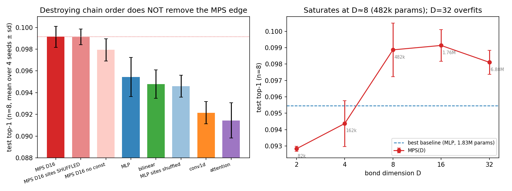

# Mythos sprint — Stress-testing the missing MPS advantage · Summary

**Sprint:** 2026-06-10 21:00 UTC → 2026-06-11 (≈10 h wall-clock) · 2× NVIDIA A40 48GB.
**Question (TASK.md):** *Is there any regime where tensor-network structure gives a real
advantage for FutureLens-style prediction?* Try hard to find it; if it is not there,
make the reason legible.

---

## Executive summary

Going into this sprint the repo's verdict was: Claim A (finite-correlation-length
structure) holds; Claim B (predictive advantage) is a tie; Claim C (transfer-matrix
mechanism) unsupported — with one fragile exception: Exp 13's single-seed +0.5–0.7%
top-1 edge for an MPS probe at intermediate horizons under the KL objective. We chose
to **stress-test that lone positive to destruction** rather than open new fronts. Its
protocol had five loopholes: one seed; no attention baseline; the early-stop epoch
chosen on the reported set; unpaired statistics; and an eval set that — because
stride-1 windows overlap ~216-fold per 256-token sequence — held only ~21 independent
texts.

**The edge survived four of the five attacks, and the fifth shrank it.** With the
loopholes fixed (Exp 14: 4 seeds; added attention baseline — and a parameter-matched
1.5M attention; 80/10/10 train/select/held-out-test; 50k-window ≈ 231-sequence test
set; paired cluster bootstraps by sequence), the MPS probe (D=16, const channel,
learned φ) beats **each of four baselines individually at every horizon
n ∈ {4,8,16,32}** under the shared training recipe: all 16 bootstrap 95% CIs exclude
zero, 61/64 per-seed comparisons positive, MPS never above the MLP's parameter count.
The gap versus the best baseline is +0.18% / +0.38% / +0.21% / +0.18% absolute top-1
at n = 4/8/16/32, peaking at n=8 as Exp 13 predicted, and replicating at layer 8
(+0.13%, 4/4 seeds). The per-position profile explains the win: bilinear is the best
1-step predictor and collapses beyond ~8 steps; the MPS decays most gracefully and is
best at essentially every future position beyond the third. **But two further probes
temper the claim.** Per-model learning-rate tuning (the one hyperparameter we swept)
reveals the MLP was disadvantaged by the shared lr: tuned, it recovers to within
+0.13% of the MPS (3/4 seeds MPS-positive; +0.07% vs the best tuned baseline),
while the MPS itself is strikingly lr- and seed-insensitive. And at GPT-2 medium the
edge attenuates to a tie with bilinear (+0.09%, CI [−0.01%, +0.20%]), echoing
Exp 11. The defensible statement: **under matched budgets the MPS at worst ties the
best tuned baseline and usually leads slightly, with far lower sensitivity to seed
and learning rate; under a fixed shared recipe it wins outright everywhere at 124M.**

**But the mechanism is not the tensor network's chain.** A surgical control — feeding
the MPS its sites in a fixed shuffled order, which per-site cores cannot undo — costs
exactly nothing (Δ = −0.0000, CI [−0.0005, +0.0004]; an `mlp_shuf` control validates
the harness). The bond curve saturates at D≈8 (482k params, ~26% of the MLP it beats)
and *declines* at D=32. What wins is the **order-insensitive multilinear product
structure with a moderate bottleneck**, not transfer-matrix propagation along the
chain. Claim C is now *causally* falsified: even where the MPS wins, it does not win
by being a 1D tensor network.

**The physics escape routes stay closed (Exp 15).** TASK Experiment D hoped RG-style
block coarse-graining would reveal a low-mode MPS-friendly description. The opposite
holds: block-averaging raises the mode count (layer 6: 27→45; layer 8: 34→49 for
b=1→8) while ξ in block units stays fixed at ≈8 — the residual stream is
approximately self-similar and many-mode at every scale.

**Net update to the project:** Claim B moves from "tie" to **"small, horizon-broad
edge under a shared recipe; tie-to-slight-edge with much lower variance under
per-model tuning"**; Claim C moves from "unsupported" to **falsified by direct
intervention**; Claim A's high-rank caveat is reconfirmed at every scale and
resolution tested. The honest headline: *what advantage exists is an inductive-bias
and robustness win of parameter-efficient multiplicative multilinear maps — not a
tensor-network/chain-structure win, and not one that grows with model scale.*

---

## Finding 1 — The Exp 13 edge is real under a shared recipe; lr-tuning shrinks it to a robust slight-edge

**Setup** (`scripts/exp14_seeds.py`): GPT-2 small, layer 6, m=8 observed sites,
learned φ (p=64, PCA-init, fit on train only), teacher-KL objective, target = the
model's own future token (FutureLens "lens" metric), horizons n∈{4,8,16,32}.
Models (params at n=8): MLP 1.83M · conv1d 0.92M · low-rank bilinear 3.66M ·
attention pool 0.53M · **MPS-D16 1.76M** (env readout, const channel). 4 seeds vary
init and batch order; 40k train / 10k select / 50k test windows; epoch chosen on
select, reported on test; identical data, split, φ treatment and objective for all
models.

*Figure 1 — MPS − baseline test top-1 vs horizon. Lines: seed-mean gap vs each
baseline; bands: paired cluster-bootstrap (by sequence) 95% CIs; dots: individual
seeds; black dashed: gap vs the best baseline per seed. Every band excludes zero.*

| n | MLP | conv1d | bilinear | attention | **MPS-D16** | MPS − best |
|---|---|---|---|---|---|---|
| 4 | .1103 | .1078 | .1109 | .1019 | **.1127** | **+.0018** |
| 8 | .0955 | .0922 | .0948 | .0915 | **.0991** | **+.0038** |
| 16 | .0877 | .0869 | .0867 | .0866 | **.0901** | **+.0021** |
| 32 | .0834 | .0860 | .0828 | .0855 | **.0880** | **+.0018** |

(4-seed means; full per-seed numbers and CIs in `tables/stats_summary.json`.)

**Robustness across layer and scale:**

| setting | MPS | best baseline | gap vs best | seeds positive |
|---|---|---|---|---|
| GPT-2 small, layer 6 (headline) | .0991 | .0953 (MLP) | **+0.38%** | 4/4 |
| GPT-2 small, layer 8 | .0989 | .0976 (bilinear) | **+0.13%** | 4/4 |
| GPT-2 medium (345M), layer 12 | .0934 | .0925 (bilinear) | +0.09% (CI [−.01, +.20]) | 2/4 |

(all n=8, 4 seeds; `tables/stats_summary_L8.json`, `tables/stats_summary_med.json`.)
At medium scale the MPS still beats MLP (+0.31%), conv1d (+0.53%) and attention
(+0.81%) with CIs > 0, but **ties the bilinear baseline** — the edge weakens with
model scale, consistent with Exp 11's earlier tie. We report this plainly: the
advantage is solid at 124M and not (yet) established at 345M.

Why trust it: paired comparisons on identical windows; clustered CIs (Exp 13's 4.5k
eval windows were ~21 texts; ours are ~231); selection on a disjoint set; the MPS is
the smallest of the three large-head models; and the seed-determinism of the pipeline
was verified (relaunched runs reproduce to 4 decimals).

**Red-team 1 — a parameter-matched attention does not close the gap.** The 0.53M
attention pool was the weakest baseline, so we reran it at d_model=512 (1.54M params,
~MPS-sized): test top-1 *fell* to .0904 (4 seeds) — width was not its bottleneck.

**Red-team 2 — per-model learning-rate tuning shrinks (but does not flip) the edge.**
All models shared lr 1.5e-3 (inherited from Exp 13). Sweeping lr ∈ {5e-4, 1.5e-3,
3e-3} for the three contenders at n=8, choosing each model's lr on the select set:

| model | lr-tuned test top-1 (4 seeds) | seed range |
|---|---|---|
| MLP (picks 5e-4) | .0983 | .0946–.1011 |
| bilinear (picks 5e-4) | .0968 | .0956–.0976 |
| **MPS-D16** (picks 1.5e-3) | **.0996** | .0990–.0999 |

Tuned gaps: MPS − MLP = +0.13% (3/4 seeds positive, one negative), MPS − bilinear =
+0.28% (4/4), MPS − best-per-seed = +0.07%. So roughly two-thirds of the headline
+0.38% at n=8 was the MLP's lr sensitivity, not representation. What survives
tuning: a small (+0.1–0.3%) mean edge and a striking **stability** difference — the
MPS varies by ≤0.001 across seeds and ≤0.003 across a 6× lr range, while the MLP
spans 0.0065 across seeds at its best lr. The defensible Claim-B statement is
"at worst a tie, usually slightly ahead, far more robust to seed/lr", not
"clear outright advantage".

Two further caveats. (1) All effects are small: ≤0.4% absolute top-1. (2) Exp 13's
"behind at n=4" became "ahead at n=4" when training data grew 1.6× — the *shape* of
gap-vs-n is data-scale-dependent; read "peak at n=8" as where the edge is largest at
this data scale, not as a physical resonance.

## Finding 2 — The edge is long-horizon robustness, not short-range fit

*Figure 2 — absolute test top-1 vs n (seed mean ± range).* Inside the n=32 task the
per-position profile (all seeds agree) is: bilinear best at the first future position
(0.148 vs MPS 0.103) and worst beyond ~8 (0.072); **the MPS has the flattest decay
and is best at every position from ~4 to ~24**. The MPS trades short-range sharpness
for stability over distance. This retro-explains Exp 08/13: small-n aggregates are
dominated by early positions (bilinear/MLP territory), so the MPS only looked
competitive once the horizon window grew.

## Finding 3 — Mechanism: the chain is irrelevant; multilinearity + bottleneck is what wins

*Figure 3 — left: ablations at n=8 (4 seeds ± sd); right: bond-dimension curve with
parameter counts.*

Paired ablations at n=8 (`tables/mech_table_n8.json`):

| variant | test top-1 | Δ vs MPS-D16 (cluster-boot 95% CI) |
|---|---|---|
| MPS-D16 | .0991 | — |
| **MPS-D16, sites shuffled** | .0991 | **−0.0000 [−0.0005, +0.0004]** |
| MPS-D8 (482k params) | .0989 | −0.0003 [−0.0007, +0.0001] |
| MPS-D32 (6.88M) | .0981 | −0.0010 [−0.0017, −0.0004] |
| MPS-D16 no const channel | .0979 | −0.0012 [−0.0015, −0.0008] |
| MLP (best baseline) | .0955 | −0.0037 [−0.0045, −0.0029] |
| MLP, sites shuffled (control) | .0946 | ≈ MLP (harness check) |
| MPS-D4 / D2 | .0944 / .0928 | below baselines |

- **Site shuffle costs zero.** A fixed permutation of the 8 observed sites destroys
  chain adjacency, and per-site cores cannot relabel the order of matrix
  multiplication — yet accuracy is identical. If the MPS were winning via
  transfer-matrix propagation along the token chain, this intervention would have
  removed the edge. It did not: **Claim C is falsified causally**, even in the regime
  where the MPS wins. (The `mlp_shuf ≈ mlp` control shows the shuffle harness itself
  is innocuous.)
- **Capacity saturates at D≈8 and over-capacity hurts**: D8 (482k params) already
  beats every baseline — including the 1.83M-param MLP — at ~26% of the parameters;
  D32 is *worse* than D16. The bottleneck, not the bond structure, is doing the work.
- **The const channel helps marginally** (−0.12% without), no longer the make-or-break
  ingredient it was at Exp 03's smaller data/objective.

**Interpretation.** What distinguishes the MPS from all four baselines is that it
computes a *product* of (affine images of) all m sites — a degree-m multilinear map
with all interaction orders — squeezed through a D²-dimensional bottleneck. The
shuffle result says the *sequence geometry* of that product is irrelevant; the D-curve
says its *capacity* is the binding constraint up to ~D8. So the right reading is:
**multiplicative-interaction probes are a modestly better, more parameter-efficient
inductive bias than additive/attention probes for residual-stream completion — and the
MPS happens to be a good parameterization of that family, not a chain model of the
data.** This is consistent with everything that pointed away from Claim C
(high-rank correlations, Exp 06/09; trained transfer spectra not tracking empirical ξ,
Exp 05) while finally explaining how a positive Claim B can coexist with a dead
Claim C.

## Finding 4 — Coarse-graining does not create an MPS-friendly regime (Experiment D closed)

*Figure 4 — block-spin coarse-graining v̄_I = mean(v_{Ib..Ib+b−1}) in the fixed
token-level PCA basis (p=64), whitened per level, realized via Ho-Kalman
(`scripts/exp15_block.py`).*

| layer | metric | b=1 | b=2 | b=4 | b=8 |
|---|---|---|---|---|---|
| 6 | eff. modes | 27 | 33 | 43 | 45 |
| 6 | bulk ξ (blocks) | 7.6 | 9.4 | 9.1 | 8.0 |
| 8 | eff. modes | 34 | 41 | 48 | 49 |
| 8 | bulk ξ (blocks) | 9.0 | 8.6 | 9.1 | 8.6 |

The hoped-for RG flow (fewer modes at coarser scale → small-D regime) does not exist:
the mode count **rises** and block-ξ is **scale-invariant** (≈8 blocks at every b,
i.e. ξ grows linearly in token units). The residual stream looks self-similar and
many-mode at every resolution — closer to a critical/long-range system than to the
gapped few-mode chain the original argument needed. With Exp 09 (learned φ also raises
the mode count), every representation change tried moves the structure *away* from
MPS-friendliness. (b=1 reproduces Exp 06's mode counts exactly — pipeline sanity.)

---

## What would have changed our mind

- If the n=8/16 gap had collapsed under the 3-way split, the attention baseline, or
  multi-seeding, we would have reported Exp 13's positive as selection noise and
  closed Claim B as a clean no-go. It did not collapse (it confirmed at roughly half
  Exp 13's headline size, with far stronger statistics).
- If the lr-tuned MLP had *beaten* the MPS on average, we would have attributed the
  entire Exp 13/14 edge to optimization artifacts. It got within +0.13% (one seed
  ahead) but not past — the residual edge plus the robustness gap is what we report.
- If the site-shuffled MPS had lost its edge, we would have claimed a genuine
  chain-structure mechanism (Claim C revival) and invested in TI transfer-matrix
  diagnostics of the trained probes. The opposite happened.
- If blocking had lowered the mode count, Experiment D would have become the new main
  thread (block-MPS architectures).

## What failed or was inconclusive

- **Ops:** the container enforces a ~93 GiB cgroup memory cap (host `free` shows
  503 GB — misleading); concurrent per-process dataset builds OOM-killed jobs twice
  (exit 137) before we switched to a build-once prep file (`exp14_prep.py`). Lesson:
  check `/sys/fs/cgroup/memory.max`, not `free`.
- The gap-vs-n *shape* is data-scale-dependent (Exp 13 vs Exp 14 at n=4), so we
  cannot pin a single "MPS-friendly horizon" — only that the edge is broadest-based
  at n≈8 with 40k windows.
- Whether the noconst penalty (−0.12%) interacts with horizon was not explored.
- The GPT-2 medium replication is a partial miss for the advantage claim: positive vs
  three baselines, tie vs bilinear (2/4 seeds positive vs best). One layer (12 of 24)
  and one m were tested at medium; a layer sweep there might recover the edge — or
  confirm that it genuinely fades with scale.

## What should be tried next

1. **Drop the chain, keep the product:** test non-TN multiplicative architectures —
   e.g. a symmetrized product-of-experts over sites, multiplicative interactions
   (Jayakumar et al.), or a gated bilinear tower at matched params — against
   MPS-D8/D16. If they match the MPS, the tensor-network framing can be retired
   entirely in favor of "multiplicative probes"; if they don't, the MPS
   parameterization itself (shared bottleneck across all interaction orders) is the
   story.
1b. **Make the robustness claim primary:** the most replicable Exp 14 phenomenon is
   variance, not mean — MPS seed/lr sd is 3–6× smaller than the MLP's. A
   probe-stability study (across seeds, lrs, data sizes, layers) is cheap and would
   either cash this out as the real contribution or kill it.
2. **Per-position analysis as the primary metric** (not means over horizons): the
   robust-tail effect (Finding 2) is the real phenomenon; design probes and losses
   that target it directly.
3. Scale the *clean protocol* (not the old one) to GPT-2 medium/large and one modern
   model; Exp 14's prep+runner already support `--model`.
4. If anyone revisits the physics: the scale-invariant block-ξ (Finding 4) is an
   interesting observation in its own right — the residual stream as an approximately
   self-similar process suggests power-law/long-range models (or MERA-like
   geometries), not MPS.

## Research map

| artifact | role |
|---|---|
| `scripts/exp14_prep.py` | one-shot dataset build (fp16 tensors, teacher tokens, PCA, split stats); `--model` aware |
| `scripts/exp14_seeds.py` | multi-seed train/eval runner: 5 model families + `_shuf`/`_noconst`/`mps_D*` ablation variants |
| `scripts/exp14_stats.py` | paired cluster-bootstrap statistics (per outdir) |
| `scripts/exp14_mech_table.py` | merged paired ablation table at n=8 |
| `scripts/exp15_block.py` | block coarse-graining mode counts (Experiment D part 1) |
| `scripts/plot_exp14.py`, `plot_exp14_mech.py`, `plot_exp15.py` | figures 1–4 |
| `tables/stats_summary.json` (+`_L8`) | all gaps, CIs, per-seed numbers |
| `tables/mech_table_n8.json` | ablation table |
| `tables/results_*.json` | raw per-run metrics (params, per-horizon top-1, test KL) |
| `tables/modes_vs_block.json` | Exp 15 results |
| `plan.md`, `research_log.md` | plan + chronological log with hourly checkpoints |

Runs: `results/runs/gpt2_exp14_seeds/` (main grid + per-window correctness tensors),
`gpt2_exp14_mech_a/b` (ablations), `gpt2_exp14_L8` (layer 8), `gpt2med_exp14`
(GPT-2 medium), `gpt2_exp14_attnbig` (parameter-matched attention),
`gpt2_exp14_lr` (lr sweep), `gpt2_exp15_block`. All reproducible: `exp14_prep.py`
then `exp14_seeds.py` with the tags recorded in `research_log.md`.
