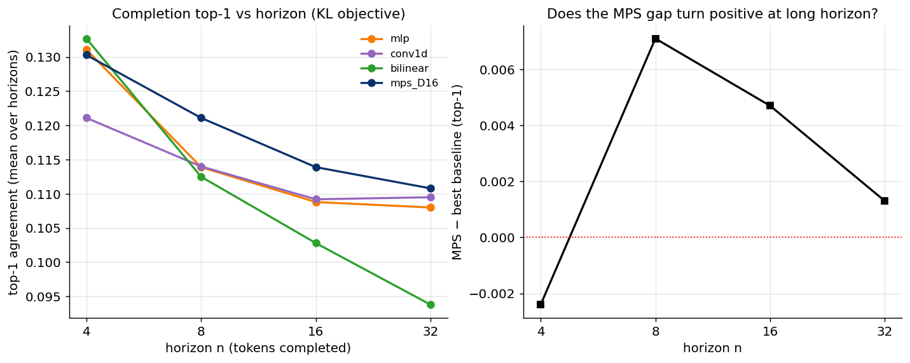

# Experiment 13 — Long-horizon completion under the KL objective · Summary

**TL;DR (a small, honest positive).** Combining the two levers the analysis flagged —
the **KL objective** (Exp 07: objective ≫ architecture) and **longer horizons** (Exp 08:
the MPS gap shrank toward zero as n grew) — produces the **first consistent positive MPS
edge** in the project. Under KL training, the MPS beats the *best* of three strong
baselines at intermediate horizons (n=8: +0.7%, n=16: +0.5% absolute top-1), peaking
around n=8 and fading to a tie by n=32; at the shortest horizon (n=4) it is marginally
behind. It is also the **most horizon-robust** probe — the fixed bilinear baseline
collapses at long horizon while the MPS holds up. **D=64 does not beat D=16**, reconfirming
bond saturation. The edge is small (~0.5–0.7% absolute, ~5% relative) and single-seed, so
"modest, regime-specific advantage", not a decisive win.

GPT-2 small · layer 6 · m=8 · learned φ (+const for MPS) · target = model's own future
token · trained with teacher-KL.

---

## Result



| n | MLP | conv1d | bilinear | **MPS-D16** | MPS − best baseline | MPS-D64 |
|---|---|---|---|---|---|---|
| 4 | 0.131 | 0.121 | **0.133** | 0.130 | −0.0024 | 0.133 |
| 8 | 0.114 | 0.114 | 0.113 | **0.121** | **+0.0071** | 0.117 |
| 16 | 0.109 | 0.109 | 0.103 | **0.114** | **+0.0047** | — |
| 32 | 0.108 | 0.110 | 0.094 | **0.111** | +0.0013 | — |

(top-1 agreement with GPT-2's own future token, mean over the n horizons.)

---

## Interpretation

- **A real but small MPS edge at intermediate horizons.** The gap is negative at n=4
  (short range — a single dense/bilinear map is enough), rises to its max +0.7% at n=8,
  and decays through n=16 (+0.5%) to a tie at n=32. The non-monotonic shape (peak at n=8)
  is consistent with a genuine intermediate-horizon effect rather than pure noise: there
  is a window where propagating information along the chain (the MPS's structural prior)
  helps more than a flat map, but the benefit erodes once the horizon outruns the bulk
  correlation length (ξ≈3–4 at layer 6, Exp 01/06).
- **MPS is the most horizon-robust probe.** It stays at/near the top for all n≥8, while
  the fixed-second-order **bilinear collapses** at long horizon (0.133→0.094). So the
  tensor-network's structural prior degrades more gracefully with horizon than a fixed
  polynomial map.
- **Objective matters (again).** Under MSE (Exp 08) the MPS merely tied at every horizon;
  under KL it edges the baselines at n=8,16. This reinforces Exp 07: the right objective
  is what lets any small architectural advantage show.
- **D=64 ≈ D=16** (n=4,8) — bond dimension is saturated; the edge is not a capacity effect.

**Verdict.** This is the most positive result for the tensor network in the study, and it
lands exactly where the physics analysis predicted (KL objective + intermediate horizon).
But it is **small** (≤0.7% absolute top-1, single seed) — it nuances rather than overturns
the overall conclusion: the MPS is *competitive-to-marginally-best* in a specific regime,
not dramatically advantaged.

## Caveats / next
- **Single seed.** The ±0.5–0.7% edge should be confirmed with multi-seed runs (3–5
  seeds) to establish significance — the cheapest, highest-value follow-up.
- Single layer (6) and model (GPT-2 small); whether the intermediate-horizon edge grows at
  larger scale / different layers is open.
- Consistent with the physics framing (GPT discussion): finite-ξ but high-rank structure →
  MPS competitive, advantage only in a narrow regime, not the clean small-D dominance
  originally hoped for.

## Reproduce
```bash
python scripts/exp13_long_horizon.py --horizons 4 8 16 --device cuda:0 --tag a --d64
CUDA_VISIBLE_DEVICES=1 python scripts/exp13_long_horizon.py --horizons 32 --device cuda:0 --tag b
python scripts/plot_exp13.py
```
