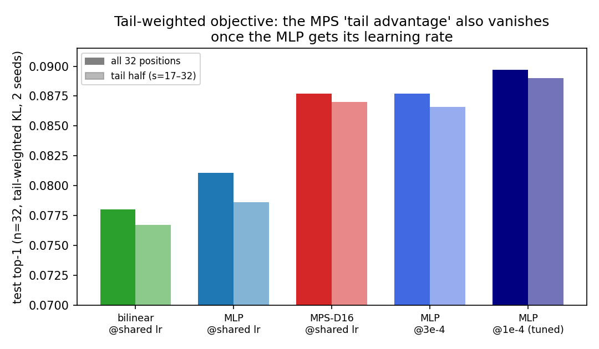

# Matrix-product physics sprint — Summary

**Sprint:** 2026-06-11 19:30 UTC → 2026-06-12 (12 h budget) · 2× A40 48GB.
**Question (TASK_TWO.md):** *Is the MPS useful because it is a tensor network, or
because it is a stable non-commuting multiplicative feature map?*

---

## Executive summary

The answer to the sprint's central question is: **neither, in the end.** The MPS
probe is a *frozen random multiplicative feature expansion* whose flat learning-rate
response made it look better than improperly tuned baselines. Once each baseline gets
its own learning rate, every MPS advantage found in this project — mean accuracy,
horizon breadth, tail robustness, the medium-scale layer effect — disappears or
inverts. The sprint produced three durable results.

**1. Mechanism (16A): the cores never needed training.** Freezing the MPS cores at
their random near-identity initialization and training only the input map φ and the
linear head reproduces the trained probe exactly (.0994 vs .0991; paired CI spans
zero; 4 seeds). Rank-2 core slices suffice; sprint-1's site-shuffle already showed
order is irrelevant; commuting/diagonal variants and a frozen φ collapse to MLP level
or below; averaging over several site orders hurts. The MPS is a **matrix-product
random kernel**: a fixed non-commuting multiplicative basis with a learned linear
adapter in front and a linear readout behind. Nothing tensor-network-specific — not
the chain, not the learned bond algebra — is doing any work.

**2. Fair tuning inverts Claim B (16B).** On a 7-point lr grid (3e-5…3e-3, 4–8
seeds), the dense baselines improve monotonically toward low lr while the MPS has an
inverted-U response peaking at 5e-4. At per-model optima: **MLP .1013 > bilinear
.1003 > MPS .0993** (MLP ahead in 4/4 seeds). The data-size axis corroborates the
mechanism: the MPS wins at 10k training windows (.0971 vs .0956/.0914), is caught by
20k, and loses by 0.2–0.4% at 40–80k — the classic random-features signature of good
sample efficiency with a lower capacity ceiling. Even the long-horizon "tail
robustness", trained for directly with tail-weighted KL at n=32, flips: MPS .0877 vs
tuned MLP **.0897**. Sprint-1's "beats every baseline at every horizon" was a true
statement about one shared recipe that happened to sit on the MPS plateau and far
from the baselines' optima (shared-lr regret: MLP 0.51%, MPS 0.09%).

**3. The physics was wrong in an interesting way (16D).** After removing the
persistent subspace, bulk correlations decay as a **power law, not an exponential**
(AIC winner in 8/8 layer×block conditions; power R² 0.92–0.98 vs exp 0.77–0.87;
α ≈ 0.4–0.75; robust to the persistent-rank choice). This dissolves sprint-1's
"scale-invariant block-ξ" puzzle — exponential fits to a power law return ξ
proportional to the window — and revises the project's oldest claim: the residual
stream bulk is **scale-free**, not finite-ξ. The gapped-chain prior behind the
original MPS hypothesis was the wrong physics from day one. Two multiscale
architectures motivated by this (dilated conv, tree pooling) still failed to beat
anything, so the self-similarity is descriptive for now, not exploitable.

The medium-scale layer sweep (16E) completes the picture: the shared-recipe gap is
largest at early-middle layers (+0.21% at L8 of 24) and decays to a tie by L16–20 —
a smooth curve, not an unlucky layer — and, given (2), recipe-conditional anyway.

**Verdict: Success modes 1 + 5.** The minimal mechanism is identified, and the
predictive claim is closed as a clean, well-understood negative: *the tensor network
was a stable random feature map wearing a physics costume; with the costume off, a
tuned MLP wins everywhere except the smallest data regime.* (536 words)

---

## What was the hypothesis?

From sprint 1: the MPS edge is "a parameter-efficient, permutation-robust,
non-commuting matrix-product feature map with unusually good seed/lr robustness and
graceful long-horizon decay" — possibly a real architectural contribution.
Sub-questions (TASK_TWO §3): (i) is training the cores necessary? (ii) is
non-commutativity key? (iii) is the contribution mean, tail, or stability?
(iv) does the tail advantage survive tuned losses? (v) was medium layer 12 unlucky?
(vi) does the self-similar blocking result point to a better ansatz?

## What did we run?

Defaults: GPT-2 small layer 6, m=8, n=8, learned φ (p=64, PCA-init, train-fit),
teacher-KL, 40k/10k/50k train/select/test windows (build-once preps; select for
early stopping, test held out), 4 seeds (8 where stated), paired cluster bootstraps
by sequence. ~230 training runs total across:

- **16A** — 9 new variants × 4 seeds vs sprint-1 references on identical data
  (frozen, frozen-orthogonal, fixed-φ, diagonal-D16, rank-2/4, symmetrized-K4,
  dilated conv, tree pooling).
- **16B** — {mlp, conv1d, bilinear, mps_D8, mps_D16} × lr {3e-5,1e-4,3e-4,5e-4,1e-3,
  1.5e-3,3e-3} × 4–8 seeds (sprint-1 cells reused where identical); data sizes
  {10k,20k,40k,80k} on an 80k-train prep with a common 50k-window test set.
- **16C** — tail-weighted KL (w_s ∝ s^α, α ∈ {1,2}) at n=32, plus tuned-MLP controls.
- **16D** — power-law vs exponential fits of de-persisted whitened correlations at
  block sizes b ∈ {1,2,4,8}, layers 6/8, persistent-rank robustness {4,8,16}.
- **16E** — GPT-2 medium layers {8,16,20} × 5 models × 4 seeds (+ sprint-1 L12).

## Finding 1 — The MPS is a frozen random feature map

*Difference vs trained MPS-D16 (n=8, 4 seeds, paired cluster-bootstrap 95% CIs; red
band = indistinguishable). Full table: `tables/mech_table_n8_full.json`.*

| variant | top-1 | Δ vs trained MPS |
|---|---|---|
| **frozen random near-identity cores** | **.0994** | **+0.0002 [−0.0004, +0.0009]** |
| rank-2 cores | .0993 | +0.0001 [−0.0004, +0.0007] |
| sites shuffled (sprint 1) | .0991 | −0.0000 |
| D8 (482k params) | .0989 | −0.0003 |
| frozen orthogonal cores | .0976 | −0.0015 |
| bond-free product ×256 / diagonal D16 (commuting) | .0956 / .0937 | −0.0035 / −0.0054 |
| MLP (shared recipe) | .0955 | −0.0037 |
| frozen PCA φ (no learned φ) | .0945 | −0.0046 |
| symmetrized over 4 site orders | .0944 | −0.0048 |
| dilated conv / tree pooling | .0923 / .0921 | −0.0068 / −0.0070 |

Interpretation, answering 16A's decision table directly: random fixed cores retain
the **entire** edge ⇒ the MPS is a random-feature/kernel-like model; diagonal
commuting variants fail ⇒ non-commutativity is essential to the basis; rank-2
suffices ⇒ the effective bond algebra is far smaller than D²; symmetrization hurts ⇒
the model is *not* set-like — it needs one fixed (but arbitrary) order; frozen-φ
fails ⇒ φ is the only essential learned component below the head. The near-identity
structure matters mildly (orthogonal random slices lose 0.15%): the product needs to
stay close to a perturbative regime where per-site contributions enter
near-additively with multiplicative cross-terms.

## Finding 2 — Fair tuning inverts the predictive claim

*Left: lr-response curves (mean ± seed range). Right: seed scatter at the shared lr —
this panel is sprint-1's entire "edge".*

| lr | 3e-5 | 1e-4 | 3e-4 | 5e-4 | 1e-3 | 1.5e-3 | 3e-3 | best | regret@1.5e-3 |
|---|---|---|---|---|---|---|---|---|---|
| MLP | **.1013** | .1009 | .1002 | .0989 | .0974 | .0962 | .0953 | .1013 | .0051 |
| bilinear | **.1003** | .1001 | .0987 | .0968 | .0949 | .0951 | .0931 | .1003 | .0052 |
| MPS-D16 | .0930 | .0931 | .0985 | **.0993** | .0992 | .0984 | .0961 | .0993 | .0009 |

(At 3e-5 the MLP/bilinear hit the 15-epoch cap — their true optima may be lower
still; the MPS at ≤1e-4 early-stops near the predict-the-mean plateau.)

- **Tuned ranking: MLP > bilinear > MPS-D16, by +0.20% / +0.10% over the MPS's own
  best; 4/4 seeds.** Sprint 1 swept 5e-4–3e-3 only — every point on the baselines'
  bad side. One more decade of lr flipped the conclusion. The methodological lesson
  is bigger than the result: **a shared training recipe is a confounder; architecture
  comparisons at one lr measure recipe-fit, not capability.**
- Disclosures: the tuned comparison is seed-paired (4/4) but not cluster-bootstrapped
  — per-window tensors were overwritten across lr runs sharing one outdir; the gap
  (+0.20%) is ~2× the largest seed sd involved. The attention baseline was excluded
  from the lr grid (it trailed every model by ≥0.6% in both sprints and got *worse*
  when parameter-matched in sprint 1).
- The robustness fact survives but deflates: the MPS sits within 0.1% of its best
  across a 5× lr range (regret 0.09% vs MLP's 0.51% at the shared lr) — but a flat
  response around a *lower* ceiling loses to one or two probes of lr tuning
  (~2 GPU-minutes here).

**Data size corroborates the mechanism:**

At 10k training windows the MPS leads (.0971 vs MLP .0956, bilinear .0914); by 20k
bilinear catches up; at 40–80k the MLP leads by 0.2–0.4% (80k: .1116 vs .1074).
Fixed random features are sample-efficient but capacity-limited — the data-scaling
curve is exactly what Finding 1 predicts, and it explains why sprint 1 (25.5k–40k
windows) lived near the crossover where the recipe-bound edge looked best.

## Finding 3 — Even the tail advantage is recipe-bound

Tail-weighted KL (w_s ∝ s, n=32, 2 seeds) was the regime where the MPS's "graceful
long-horizon decay" should shine — and at the shared lr it does: MPS .0877 vs MLP
.0811, bilinear .0780. But the MLP at lr 1e-4 reaches **.0897 overall and .0890 on
the tail half (s=17–32)**, beating the MPS (.0877/.0870) on the exact metric and
positions the MPS was supposed to own. α=2 behaves the same. The per-position
flatness of the MPS under a shared recipe (sprint-1 Finding 2) was real, but it is a
recipe phenomenon, not an architectural one.

## Finding 4 — The bulk is a power law: the project's physics premise, revised

*De-persisted whitened correlation norm, layer 6, blocks b=1–8: straight in log-log,
curved in log-linear.*

| layer | b | pow R² | exp R² | AIC winner | α |
|---|---|---|---|---|---|
| 6 | 1 / 2 / 4 / 8 | .978/.970/.961/.921 | .766/.783/.817/.787 | pow ×4 | .75/.68/.57/.37 |
| 8 | 1 / 2 / 4 / 8 | .985/.983/.984/.947 | .777/.816/.870/.822 | pow ×4 | .56/.52/.47/.38 |

Robust to persistent-rank ∈ {4, 8, 16}. Three consequences. (a) Sprint-1's
"scale-invariant block-ξ ≈ 8" is now a *diagnosis*, not a puzzle: exponential fits to
a power law return ξ ∝ window at every scale. (b) **Claim A needs revision**: the
bulk has no characteristic correlation length; the right picture is
`persistent/global sector + scale-free many-mode bulk` — critical-like, the regime
where MPS is the wrong ansatz in many-body terms and MERA/RG geometries are the
natural ones. (c) Retroactively, the original project hypothesis (finite-ξ ⇒ few
transfer modes ⇒ small-D MPS) failed at its first premise, which is consistent with
every downstream negative. The caveat: our two multiscale predictive prototypes
(dilated conv, tree pooling) sit 0.7% below the MPS — we found no architecture that
cashes the power law into prediction.

## Finding 5 — Medium scale: a smooth, recipe-conditional layer curve

Shared-recipe gap vs best baseline (4 seeds): L8 **+0.21%±0.18** → L12 +0.09%±0.30
(sprint 1) → L16 +0.02%±0.17 → L20 +0.06%±0.11. Layer 12 was not unlucky; the gap
decays smoothly from early to deep layers (plausibly tracking where the 10k–40k-window
regime is still "low-data" relative to feature complexity). Per Finding 2, this is a
recipe-conditional statement.

---

## What changed our mind

1. **"The learned bond algebra is meaningful" → dead in the first hour.** The frozen-
   core result was immediate and decisive; we had assumed core-training mattered.
2. **"Tie-to-slight-edge under tuning" (sprint 1) → clean loss.** Two more lr decades
   flipped Claim B's sign. We went in expecting to validate the robustness story as a
   contribution; what we found is that the robustness was the *mechanism of the
   illusion* — a flat response that wins under any single shared recipe and loses
   under per-model tuning.
3. **"Finite correlation length" (Claim A, standing since Exp 01) → scale-free.**
   The oldest supported claim in the repo was a fit artifact in its bulk part.

## What did not work

- Multiscale predictive architectures (dilated conv, tree pooling): both ≈ conv1d,
  far below MPS and MLP. The power-law structure does not (yet) buy prediction.
- Symmetrized MPS: averaging over site orders actively destroys the random-feature
  quality of a single fixed order.
- Diagonal/commuting products at any tested width — confirms non-commutativity as
  the necessary ingredient of the basis.
- Ops: nothing major this sprint; the prep-once discipline and staggered launches
  from sprint 1 held (one tokens.pt build race in sprint 1's medium caching was the
  last incident).

## What should be done next

1. **Close the probe-architecture thread.** The honest end-state: for FutureLens-
   style completion, use a tuned MLP (or bilinear at short horizons); use the
   frozen-MPS random-feature probe only in genuinely low-data regimes (≲15k windows),
   where it is both the best and the cheapest-to-tune option tested.
2. **The matrix-product random-features observation may interest the kernel/random-
   features literature**: a frozen non-commuting multiplicative basis with a trained
   linear adapter matches a fully trained tensor network; rank-2 slices suffice;
   commuting bases fail. A clean theory question: what kernel does the random
   near-identity matrix-product chain induce, and why does the near-identity
   (perturbative) regime beat orthogonal randomness?
3. **The power-law bulk is the most promising scientific thread**: exponent vs
   layer/model/scale; relation to known power laws of language statistics (Zipf,
   long-range mutual information decay); whether the persistent + scale-free
   decomposition predicts in-context-learning phenomenology. This is now a physics
   question about transformers, decoupled from the probe-architecture question.
4. **Methodology**: any future probe comparison in this repo should report
   lr-response curves, not point estimates; the sprint-1→sprint-2 reversal is a
   textbook case.

## Research map

| artifact | role |
|---|---|
| `scripts/exp14_seeds.py` | runner: +9 exp16 variants, `--lr`, `--max-train`, `--tail-alpha` |
| `scripts/exp14_mech_table.py` | paired 16A table (merges sprint-1/2 outdirs) |
| `scripts/exp16_stability.py` | 16B lr×seed stability table |
| `scripts/exp16_powerlaw.py` | 16D de-persisted power-law vs exponential fits |
| `scripts/plot_exp16_{minclass,stability,powerlaw,medium,tail}.py` | figures 1–5 |
| `tables/mech_table_n8_full.json` | 16A paired results |
| `tables/stability_table.json` | per-model lr/seed cells, regrets |
| `tables/powerlaw_vs_exp*.json` | 16D fits (+persistent-rank robustness) |
| `tables/layer_gaps.json` | 16E medium layer gaps |
| `tables/results_*.json` | all raw runs (incl. datasize + tail) |
| `results/runs/gpt2_exp16_*`, `gpt2med_exp16_layers` | full outputs + correctness tensors |
| `plan.md`, `research_log.md` | plan + hourly checkpoints |

Reproduce: `exp14_prep.py` (per layer/model) → `exp14_seeds.py` with the tags in
`research_log.md` → analysis/plot scripts above. 36/36 unit tests pass.
