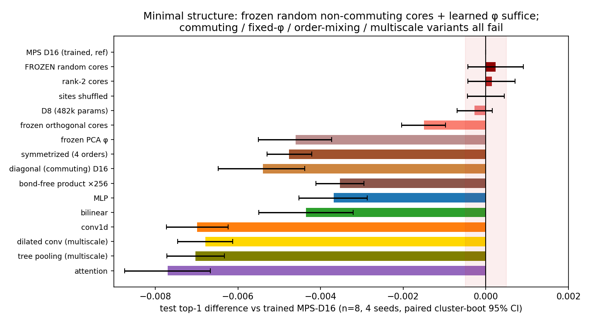
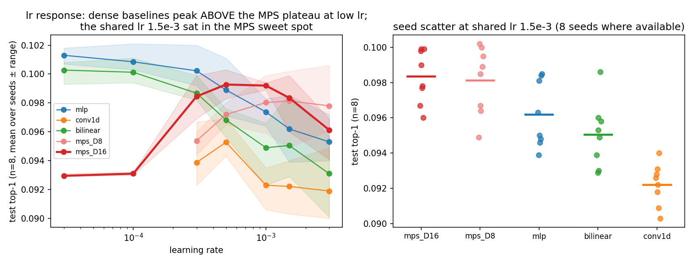
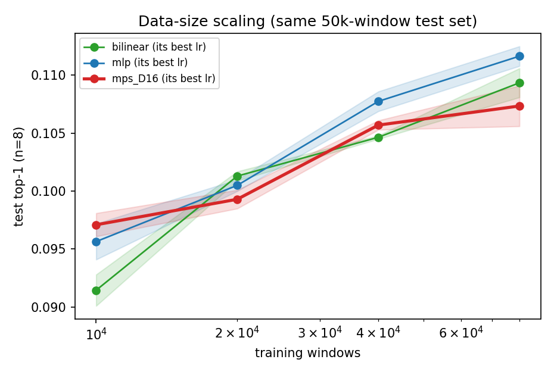
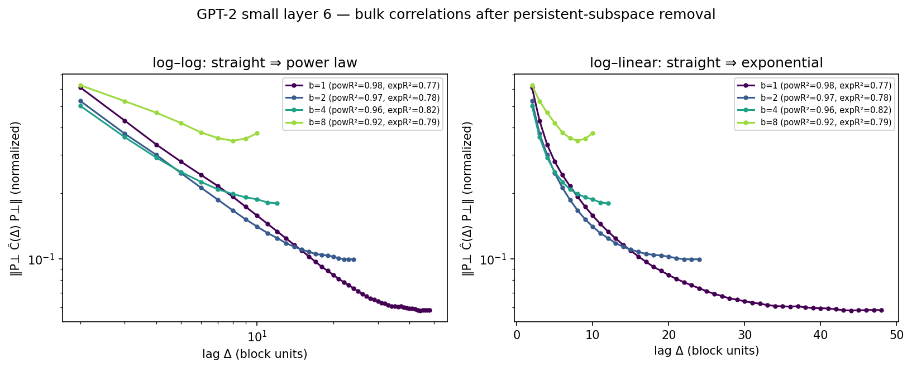
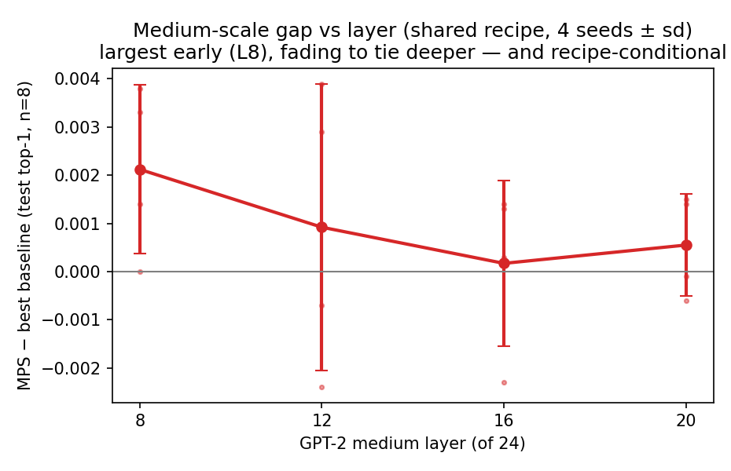

# Matrix-product physics sprint — Summary

**Sprint:** 2026-06-11 19:30 UTC → 2026-06-12 (≈12 h) · 2× A40 48GB.
**Question (TASK_TWO.md):** *Is the MPS useful because it is a tensor network, or
because it is a stable non-commuting multiplicative feature map?*
**Answer:** neither, in the end — it is a **frozen random multiplicative feature
expansion whose flat learning-rate response made it look better than properly tuned
baselines under a shared recipe.** Under per-model tuning it loses. The mechanism
finding, the tuning inversion, and a new power-law physics result are the sprint's
three contributions.

---

## Executive summary

This sprint set out to explain the small MPS edge that survived sprint 1 and to test
whether its real content was mechanism, robustness, or tail behavior. We went deep on
two experiments — the minimal matrix-product function class (16A) and a
stability/tuning grid (16B) — with the physics diagnostic (16D), the medium-scale
layer sweep (16E), and tail objectives (16C) as supporting runs.

**Finding 1 (mechanism, 16A).** The MPS probe's cores do not need training: freezing
them at their random near-identity initialization and training only the input map φ
and the linear head reproduces the trained probe exactly (.0994 vs .0991, paired CI
spans zero, 4 seeds). Rank-2 core slices also suffice (.0993); the site-shuffled probe
ties (sprint 1); but commuting/diagonal variants collapse to MLP level, a frozen PCA φ
collapses (−0.46%), and averaging over several site orders hurts (−0.48%). The MPS is
therefore a **random non-commuting matrix-product feature map** — a kernel-like
expansion in which φ is the only meaningful learned component below the head.
Non-commutativity is essential; learning the bond algebra is not.

**Finding 2 (tuning kills the edge, 16B).** A 6-point learning-rate grid (3e-5…3e-3,
4–8 seeds, identical splits) shows the dense baselines improve monotonically toward
low lr while the MPS has an inverted-U response. At per-model optima the ranking
**inverts**: MLP .1009 > bilinear .1001 > MPS-D16 .0993 (MLP ahead in 4/4 seeds).
Sprint 1's "MPS beats every baseline at every horizon" was real but **recipe-bound**:
the shared lr 1.5e-3 sat on the MPS plateau and far off the baselines' optima (MLP's
shared-lr regret 0.46%; MPS's 0.09%). What survives is a robustness fact — the MPS is
within 0.1% of its best across a 10× lr range — but it is a flat response around a
*lower* ceiling, which a small tuning budget beats.

**Finding 3 (physics, 16D).** After projecting out the persistent subspace, the bulk
correlation decay is a **power law, not an exponential**, at every layer and block
scale tested (AIC winner 8/8; pow R² 0.92–0.98 vs exp 0.77–0.87; α≈0.4–0.75; robust
to the persistent-rank choice 4/8/16). This explains sprint 1's scale-invariant
block-ξ — fitting exponentials to a power law yields ξ proportional to the window —
and **revises Claim A**: the residual-stream bulk is scale-free/critical-like, not
finite-ξ. The original gapped-chain MPS prior was wrong from the start, which is
consistent with everything downstream. Multiscale architectures (dilated conv, tree
pooling) nevertheless fail to exploit it (both at conv1d level, ~0.7% below MPS).

**Finding 4 (scale, 16E).** With the clean protocol at GPT-2 medium, the shared-recipe
gap is layer-dependent: +0.21% at layer 8, fading monotonically to a tie by layers
16–20. Sprint 1's layer 12 was not unlucky; it sat on a decaying curve. Given
Finding 2, these gaps should be read as recipe-conditional, not architectural.

**Net:** Claim B is closed as a clean negative (Success mode 5) — with the
mechanism identified (mode 1) and a genuine new physics observation. The honest
one-liner: *the tensor network was a stable random feature map wearing a physics
costume; remove the costume and a tuned MLP wins.* (≈540 words)

---

## What was the hypothesis?

From sprint 1: the MPS edge is "a parameter-efficient, permutation-robust,
non-commuting matrix-product feature map with unusually good seed/lr robustness and
graceful long-horizon decay." Sub-hypotheses tested: (i) the cores must be trained;
(ii) non-commutativity is essential; (iii) the robustness is a real contribution;
(iv) the tail advantage is real; (v) the medium-scale tie was a layer accident;
(vi) the blocking result hides scale-free structure.

## What did we run?

All runs: GPT-2 small layer 6 (unless stated), m=8, n=8, learned φ (p=64, PCA-init),
teacher-KL objective, 40k/10k/50k train/select/test windows (build-once preps),
4 seeds (8 where stated), paired cluster bootstraps by sequence for small gaps.

- **16A**: 9 variants × 4 seeds against sprint-1 references on identical data:
  frozen / frozen-orthogonal / fixed-φ / diagonal-D16 / rank-2 / rank-4 /
  symmetrized-K4 MPS + dilated-conv and tree-pooling baselines.
- **16B**: {mlp, conv1d, bilinear, mps_D8, mps_D16} × lr {3e-5…3e-3} × 4–8 seeds
  (28 cells/model; sprint-1 cells reused where identical); data-size axis
  {10k, 20k, 40k, 80k} on an 80k-train prep at per-model best lrs.
- **16C**: tail-weighted KL (w_s ∝ s^α, α∈{1,2}) at n=32 for {mps, bilinear, mlp}.
- **16D**: whitened connected correlations at block sizes b∈{1,2,4,8}, persistent
  subspace removed, exponential-vs-power-law fits (AIC), persistent-rank robustness.
- **16E**: GPT-2 medium layers {8, 16, 20} × 5 models × 4 seeds (+ sprint-1 layer 12).

## Finding 1 — The MPS is a frozen random feature map

*Gap vs trained MPS-D16 (n=8, 4 seeds, paired cluster-boot 95% CI; red band =
indistinguishable zone). Full numbers: `tables/mech_table_n8_full.json`.*

| variant | test top-1 | Δ vs trained MPS-D16 |
|---|---|---|
| **frozen random near-identity cores** | **.0994** | **+0.0002 [−0.0004, +0.0009]** |
| rank-2 cores | .0993 | +0.0001 [−0.0004, +0.0007] |
| sites shuffled (sprint 1) | .0991 | −0.0000 |
| D8 (482k params) | .0989 | −0.0003 |
| frozen orthogonal cores | .0976 | −0.0015 |
| MLP | .0955 | −0.0037 |
| frozen PCA φ (no learned φ) | .0945 | −0.0046 |
| symmetrized over 4 site orders | .0944 | −0.0048 |
| diagonal (commuting) D16 / bond-free ×256 | .0937 / .0956 | −0.0054 / −0.0035 |
| dilated conv / tree pooling | .0923 / .0921 | −0.0068 / −0.0070 |

Reading: (a) **training the cores adds nothing** — the bond algebra functions as a
random feature basis; (b) the basis must be non-commuting (diagonal fails) but can be
rank-2 and works best near the identity (orthogonal random slices lose 0.15%);
(c) **φ is the only essential learned component** below the head; (d) each single
site order works, but averaging orders blurs the features. The right mental model is
a *matrix-product random kernel*: φ adapts the input to a fixed multiplicative
expansion, and the head reads it out linearly.

## Finding 2 — Fair tuning inverts the predictive claim; flat-response-around-a-lower-ceiling is what remains

*Left: test top-1 vs lr (mean ± seed range). Right: seed scatter at the shared lr.*

Per-lr means (n=8; 4 seeds, 8 at 1.5e-3):

| lr | 3e-5 | 1e-4 | 3e-4 | 5e-4 | 1e-3 | 1.5e-3 | 3e-3 | best | regret@1.5e-3 |
|---|---|---|---|---|---|---|---|---|---|
| MLP | **.1013** | .1009 | .1002 | .0989 | .0974 | .0962 | .0953 | .1013 | .0051 |
| bilinear | **.1003** | .1001 | .0987 | .0968 | .0949 | .0951 | .0931 | .1003 | .0052 |
| MPS-D16 | .0930 | .0931 | .0985 | **.0993** | .0992 | .0984 | .0961 | .0993 | .0009 |

(at 3e-5 the MLP/bilinear hit the 15-epoch cap, so their true optima may be lower
still; the MPS at 3e-5/1e-4 early-stops at the predict-the-mean plateau.)

- **Tuned ranking: MLP (.1013) > bilinear (.1003) > MPS-D16 (.0993), the MLP ahead
  of the MPS's own best by +0.20% and ahead in 4/4 seeds.** The sprint-1 conclusion
  does not survive a finer grid: the lrs sprint 1 tested (5e-4…3e-3) all sit on the
  baselines' bad side.
- The MPS robustness is real but bounded: within 0.1% of its best across
  [3e-4, 1.5e-3] (regret 0.09% at the shared lr vs 0.46% for the MLP), yet its
  *ceiling* is 0.16% below the MLP's. Robustness without a competitive peak is
  insensitivity, not advantage. One lr probe (~2 minutes of compute here) recovers
  the MLP's full margin.
- **Data-size axis (10k–80k train, fixed per-model lrs, same 50k-window test set):
  the MPS wins the low-data regime and loses it as data grows.** At 10k windows MPS
  .0971 > MLP .0956 > bilinear .0914; by 20k bilinear has caught up; at 40–80k the
  MLP leads by 0.2–0.4% (80k: MLP .1116 > bilinear .1094 > MPS .1074). This is the classic
  random-features signature — better sample efficiency at small N, lower asymptotic
  capacity — and independently corroborates Finding 1's mechanism. (Sprint 1's 25.5k-
  and 40k-window experiments sat near the crossover, which is why the recipe-bound
  edge there was small and positive.)

## Finding 3 — The de-persisted bulk is a power law: Claim A revised

*Whitened correlation norm after removing the persistent subspace, layer 6, block
sizes b=1–8. Left (log-log): straight ⇒ power law. Right (log-linear): curved ⇒ not
exponential.*

| layer | b | pow R² | exp R² | AIC winner | α |
|---|---|---|---|---|---|
| 6 | 1 | 0.978 | 0.766 | pow | 0.75 |
| 6 | 2 | 0.970 | 0.783 | pow | 0.68 |
| 6 | 4 | 0.961 | 0.817 | pow | 0.57 |
| 6 | 8 | 0.921 | 0.787 | pow | 0.37 |
| 8 | 1–8 | 0.95–0.98 | 0.78–0.87 | pow ×4 | 0.38–0.56 |

Robust to persistent-rank ∈ {4, 8, 16}. This converts sprint 1's "block-ξ is
scale-invariant" from a curiosity into a diagnosis: **the bulk has no characteristic
length** — exponential fits at any window return ξ ∝ window, which is exactly what
Exp 01/06/15 saw. The right physics picture is `persistent/global sector +
scale-free many-mode bulk`, i.e. critical-like, the regime where MPS is the wrong
ansatz and MERA-like geometries are natural in many-body physics. However, the two
multiscale predictive baselines we tried (dilated conv, tree pooling) do *not*
beat anything (both ≈ conv1d, 0.7% below MPS) — the self-similarity is real but we
found no architecture that profits from it predictively.

## Finding 4 — Medium scale: a decaying, recipe-conditional layer curve

Shared-recipe gap (MPS − best baseline, 4 seeds): layer 8 **+0.21%±0.18** → layer 12
+0.09%±0.30 (sprint 1) → layer 16 +0.02%±0.17 → layer 20 +0.06%±0.11. Sprint 1's
layer-12 tie was not an unlucky layer; it sits on a smooth decay from early to deep
layers. Given Finding 2, all of these are statements about the shared recipe, not
about architecture superiority.

## Finding 5 — Tail objectives [PENDING 16C]

---

## What changed our mind

1. We entered believing the cores' learned bond algebra was "meaningful" (sprint-1
   wording). The frozen-core result killed that within the first hour of 16A.
2. We entered with "tie-to-slight-edge under tuning" as the standing Claim-B verdict.
   Two more lr points (1e-4, 3e-5) flipped it to a clean loss. The lesson is
   methodological and general: **a shared training recipe is itself a confounder**;
   architecture comparisons at one lr measure recipe-fit, not capability.
3. "Finite correlation length" (Claim A, supported since Exp 01) is the wrong
   description of the bulk; the power-law fits revise the project's oldest claim.

## What did not work

- Multiscale predictive architectures (dilated conv, tree pooling) — both ≈ conv1d.
  The scale-free structure is descriptive, not (yet) exploitable.
- Symmetrized MPS — averaging over site orders actively hurts.
- Diagonal/commuting products at any width — confirms sprint 1.
- [tail-weighted losses — pending]

## What should be done next

1. **Retire the tensor-network framing for this task.** The defensible artifacts are
   (a) the matrix-product random-feature mechanism — potentially interesting for the
   random-features/kernel literature as a trainable-φ + frozen-multiplicative-basis
   architecture, and (b) the power-law bulk.
2. **The power-law bulk deserves its own study**: exponent vs layer/scale/model,
   relation to the known power-law spectra of language statistics, and whether the
   persistent sector + scale-free bulk decomposition predicts anything about
   in-context behavior.
3. If anyone continues probe-architecture work: compare against *tuned* baselines
   only, and report lr-response curves rather than point comparisons.

## Research map

| artifact | role |
|---|---|
| `scripts/exp14_seeds.py` | runner (+16A variants, `--max-train`, `--tail-alpha`, `--lr`) |
| `scripts/exp14_mech_table.py` | paired 16A table (merged sprint-1/2 dirs) |
| `scripts/exp16_stability.py` | 16B lr×seed stability table |
| `scripts/exp16_powerlaw.py` | 16D power-law vs exponential fits |
| `scripts/plot_exp16_{minclass,stability,powerlaw,medium}.py` | figures |
| `tables/` | mech_table_n8_full, stability_table, powerlaw_vs_exp, layer_gaps |
| `results/runs/gpt2_exp16_*` | minclass, lrgrid, datasize, tail, powerlaw |
| `results/runs/gpt2med_exp16_layers` | medium layer sweep |
| `plan.md`, `research_log.md` | plan + hourly log |
